# Datus 智能数据代理（Data Agent）架构设计文档

> **文档编号**：DRD-02
> **版本**：0.1（草稿）
> **状态**：评审中
> **适用产品**：Datus（智能数据代理 / Data Agent，开源数据工程 Agent）
> **编写基准**：以仓库真实代码与官方文档为准（`datus/` 源码目录结构、`docs/` 站点、`conf/` 配置样例、需求规格说明书 DRD-01）
> **依赖文档**：DRD-01《需求规格说明书》——本文档中所有 FR/NFR 编号引用自 DRD-01

---

## 1. 架构概述

### 1.1 架构目标

Datus 的架构目标是支撑以下产品主张（DRD-01 §2.1）：

1. **可演化的上下文**：知识库（语义模型、指标、Reference SQL、SQL Summary、平台文档）作为一等的架构元素，参与每一次生成，并随交互持续演进。
2. **可配置的智能**：Node 工作流引擎把"LLM 推理"结构化，使同一引擎既可跑低成本的 `fixed` 流水线，也可跑带反思的 `reflection` 流水线，还能被封装为领域 Subagent。
3. **多入口单引擎**：CLI / REST API / MCP / Web Chatbot / IM 网关共享同一 Agent 引擎，行为一致，差异收敛在交互层。
4. **本地优先、可观测、可扩展**：数据与配置默认本地化（`~/.datus`、项目 `subject/`）；全链路 OpenTelemetry 追踪；Node / Provider / 数据源 / 语义引擎 / BI 平台 / 调度器全部走扩展点。

### 1.2 设计原则

| 原则 | 落点 |
|---|---|
| **上下文即产品** | 知识库是"准确性"的载体，检索质量与生成质量同等对待（FR-020/041） |
| **结构化编排 + Agentic 自由** | 节点 DAG 决定"做什么"，Agentic 节点内部决定"怎么做"（FR-002） |
| **人在回路** | 计划模式、SQL 授权、HITL 端点为高危步骤提供人工确认（FR-003/023） |
| **扩展点优先** | 新增能力走注册/工厂/适配器，不修改核心引擎（NFR-EXT） |
| **失败可解释** | 校验失败清单、错误码体系、追踪树共同保证"错在哪、为什么"可回答（FR-021/090） |
| **本地优先 + 分层隔离** | 项目级/用户级双层隔离；多租户只读配置不回写授权（C4、FR-101/103） |

### 1.3 质量属性（对应 NFR）

| 属性 | 架构手段 | 引用 |
|---|---|---|
| 可扩展性 | Node 工厂、Provider 注册、Adapter 体系、可选包降级 | NFR-EXT-01~06 |
| 可观测性 | OTel 全链路 span 树 + 多后端导出 + 脱敏 | NFR-OBS-01~04 |
| 安全性 | SQL 校验/权限档/沙箱/脱敏/工具过滤 | NFR-SEC-01~06 |
| 准确性 | reflection 工作流 + KB 检索 + 校验修复 + Benchmark 度量 | NFR-ACC-01~05 |
| 性能 | 流式输出、执行可中断、检索低延迟、上下文压缩 | NFR-PERF-01~06 |
| 可移植性 | 本地优先存储、`${ENV_VAR}` 注入、无闭源运行时 | C1/C2/C5 |

---

## 2. 系统上下文图

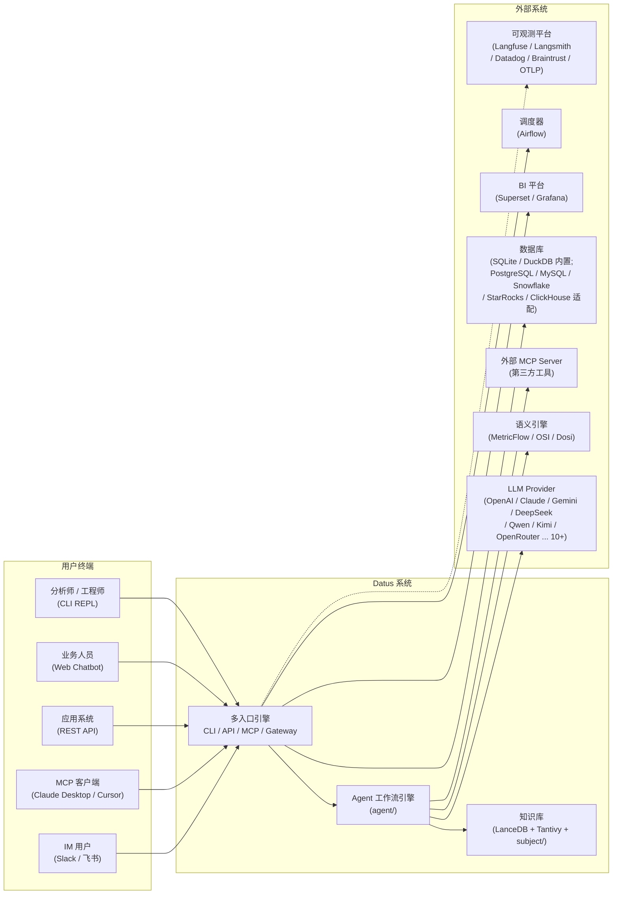

**说明**：系统对外有 5 类终端与 7 类外部依赖。LLM、语义引擎、外部 MCP 由 Agent 层消费；数据库、BI、调度器由引擎经适配器消费；可观测性为旁路出口（不参与请求路径，故障不阻断业务）。

---

## 3. 逻辑架构

### 3.1 分层设计

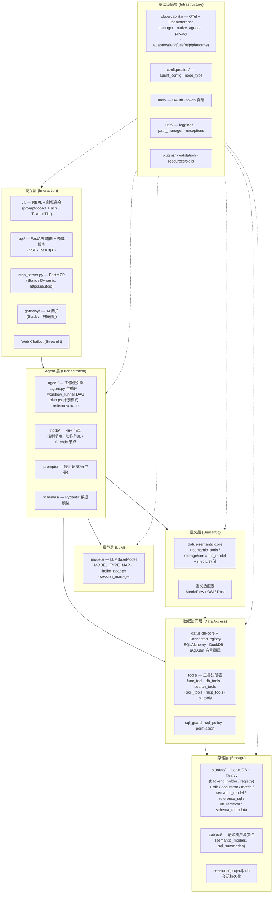

**分层职责与依赖规则**：

- 依赖单向向下：交互层 → Agent 层 → 模型/语义/数据访问层 → 存储层；基础设施层为横向服务，任何层可用。
- 交互层不得直接访问存储层；所有数据访问经 `tools/` 工具注册表与数据访问层（Guardrails：不直接 import 数据库驱动，统一走 ConnectorRegistry）。
- Agent 层不硬编码 LLM 调用，一律经 `models/`（Guardrails：LLM 调用走 LLMBaseModel）。

### 3.2 核心模块划分（对应真实包/目录）

| 模块 | 真实位置 | 职责 | 对应能力（DRD-01） |
|---|---|---|---|
| 工作流引擎 | `datus/agent/`（agent.py、workflow.py、workflow_runner.py、plan.py、reflect.py、evaluate.py） | 工作流定义与 DAG 执行、计划模式、反思评估 | FR-002/003 |
| 节点体系 | `datus/agent/node/`（48+ 节点 + `node_factory.py` 工厂） | 控制/动作/Agentic 三类节点实现 | FR-002、NFR-EXT-01 |
| 模型网关 | `datus/models/`（base.py、litellm_adapter.py、各 provider 实现、session_manager.py） | 多 Provider 统一调用、会话级模型管理 | FR-001、NFR-EXT-02 |
| 语义层 | `datus-semantic-core` + `datus/tools/semantic_tools` + `storage/{semantic_model,metric}` | 语义模型/指标存取与查询、适配器对接 | FR-010~014 |
| 数据访问 | `datus-db-core` + `datus/tools/db_tools` | 数据源连接、方言翻译、SQL 执行 | FR-030~033 |
| 工具系统 | `datus/tools/`（func_tool 等 12 个子目录 + registry） | 工具注册、权限、代理、SQL 护栏 | FR-022/023、FR-072/073 |
| 知识库存储 | `datus/storage/`（LanceDB 后端 + Tantivy 全文 + 各领域存储模块） | 向量/全文索引、领域对象存取 | FR-040~043 |
| 会话管理 | `datus/models/session_manager.py` + `storage/session_state.py` | 会话生命周期、压缩、分支 | FR-004/005/102 |
| API 服务 | `datus/api/`（main.py、service.py、routes/） | REST v1 路由、领域服务编排、SSE | FR-070/071 |
| MCP 服务 | `datus/mcp_server.py` | MCP Server（工具暴露）、Static/Dynamic | FR-072 |
| MCP 客户端 | `datus/tools/mcp_tools/` | 外部 MCP Server 消费、过滤器 | FR-073 |
| 调度 | `datus-scheduler-core` + `datus-scheduler-airflow` + scheduler 节点 | Airflow 作业生命周期 | FR-050/051 |
| BI 集成 | `datus-bi-core` + `datus-bi-superset`/`datus-bi-grafana` + `tools/bi_tools` | 仪表盘 CRUD、Dashboard Copilot | FR-080/082 |
| 可观测性 | `datus/observability/` | OTel 追踪、OpenInference 插桩、脱敏、多后端导出 | FR-090~093 |
| 配置体系 | `datus/configuration/`（agent_config.py、node_type.py） | 配置解析、白名单、节点类型注册 | FR-103 |
| 认证 | `datus/auth/`（oauth_manager.py 等） | OAuth / Claude 凭据 / token 存储 | FR-101 配套 |
| 校验 | `datus/validation/`（builtin_checks.py 等） | SQL 质量规则、报告 | FR-021 |
| 网关 | `datus/gateway/`（adapters/channel） | Slack / 飞书接入 | §5.1 用户接口 |
| 插件 | `datus/plugins/`（registry、activation、store） | 插件注册与激活 | FR-063 |

> **包拆分说明**：`datus-*` 系列核心包（semantic-core、bi-core、db-core、storage-base、scheduler-core）独立发布，业务包按需依赖。**tradeoff**：包级边界让各领域可独立演进与复用（如 `datus-bi-core` 可在无 Agent 的项目单独使用），代价是跨包接口变化需版本协同——这是本项目最核心的模块化决策之一。

---

## 4. 部署架构

### 4.1 三种部署形态

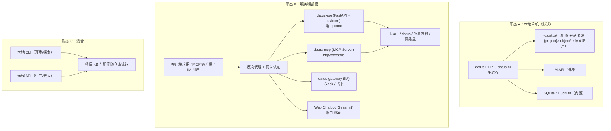

| 形态 | 适用场景 | 关键决策 |
|---|---|---|
| A 本地单机 | 个人工程师探索、构建 KB、生成 Subagent | 零部署，`install.sh` 一键装；所有数据本地化（隐私/离线友好，代价是协作弱） |
| B 服务端 | 团队/企业：Web、API、MCP、IM 多入口 | 多进程共享同一数据目录；用户隔离靠 `X-Datus-User-Id` + 前置网关认证（FR-101）；配置经 `AgentConfig` 注入时可设只读（`config_mutable=False`，C4） |
| C 混合 | 工程师本地开发 + 生产远程服务 | 项目级 `subject/` 与 `.datus/config.yml` 随仓库流转，保证"本地探索的上下文"可移植到服务端 |

### 4.2 入口点与进程模型

| 入口（pyproject.toml） | 进程 | 说明 |
|---|---|---|
| `datus` / `datus-cli` | REPL / 单命令 | CLI 交互、`--print` JSON 流 |
| `datus-api` | FastAPI 服务 | REST v1，SSE 流式 |
| `datus-mcp` | MCP Server | Static/Dynamic 多数据源路由 |
| `datus-gateway` | IM 网关 | Slack / 飞书 channel 适配 |
| `datus-agent` | Agent 模式 / Benchmark 运行器 | `benchmark` / `eval` 子命令 |

五个入口共享同一 Agent 引擎与配置体系（`datus/entrypoints.py` 统一定义），差异收敛在启动参数与交互包装层。

---

## 5. 技术架构选型与理由

> 所有选型以"为什么是它、替代是什么、代价是什么"三问展开；事实出处：`pyproject.toml` 依赖与 DRD-01 §2。

| 领域 | 选型 | 理由（tradeoff 为主） |
|---|---|---|
| Agent 框架 | **openai-agents SDK** + LiteLLM 桥接（`models/litellm_adapter.py`） | 官方 SDK 提供成熟的多轮工具循环与 span 插桩；经 OpenInference 把 SDK span 并入自家追踪树。**tradeoff**：跟随 SDK 演进 vs 厂商中立——用 LiteLLM 层隔离 Provider 差异，同时保留 OpenAI 生态兼容 |
| 多模型路由 | **LiteLLM**（`LITELLM_LOCAL_MODEL_COST_MAP` 成本映射） | 一套接口覆盖 10+ Provider（OpenAI/Claude/Gemini/DeepSeek/Qwen/Kimi/OpenRouter…），统一重试/降级/成本核算。**tradeoff**：统一层掩盖厂商特有参数（如部分推理特性），模型级能力差异由各 provider 适配（`openai_compatible.py` 等）显式暴露 |
| 模型实现 | `LLMBaseModel` + `MODEL_TYPE_MAP` 注册 | 新 SDK/自托管端点（`agent.models.<name>`，base_url/api_key/model）不需改引擎。**tradeoff**：每厂商一个适配文件 vs 用 SDK 原生类——选前者换取类型安全与按厂商调参 |
| 向量库 | **LanceDB**（嵌入式，`storage/backend_holder`） | 免服务部署、文件式存储、按项目分片（`data/{project}/`）、零运维。**tradeoff**：嵌入式简单可靠 vs 分布式/高并发扩展性——本项目本地优先主张下选嵌入式；服务端形态可共享网络盘 |
| 全文检索 | **Tantivy**（`storage/fts.py`） | 关键词精确检索补充向量语义召回，构成混合检索（FR-041）。**tradeoff**：双索引维护成本 vs 召回质量（术语/代码类查询全文更强） |
| 嵌入 | **FastEmbed**（all-MiniLM-L6-v2 384 维默认；文档用 e5-large 1024 维） | 本地推理、无外部服务；多语言文档用更大模型。**tradeoff**：本地嵌入的隐私/离线优势 vs 模型能力上限（可选 OpenAI 嵌入，`embedding_openai.py`） |
| 分析引擎 | **DuckDB**（内置）+ SQLite | 零配置开箱（`--datasource demo`）、分析型 SQL 本地执行。**tradeoff**：内置引擎免部署 vs 生产库仍走适配器（PostgreSQL/MySQL/Snowflake…）——两层满足"快速上手"与"生产接入" |
| SQL 方言 | **SQLGlot** | 方言解析/翻译/能力探测，一份 SQL 多库可跑（FR-031）。**tradeoff**：方言覆盖广 vs 极端方言特性需适配器兜底 |
| 语义引擎 | **datus-semantic-core** + MetricFlow/OSI/Dosi 适配器 | 指标口径一次定义多处复用（FR-012）。**tradeoff**：语义层准确性收益 vs 语义模型建设/同步成本——未覆盖查询回退原生 SQL |
| MCP | **FastMCP**（http/sse/stdio 三传输） | MCP 生态互操作（Claude Desktop/Cursor 直接消费）；Static/Dynamic 双模式。**tradeoff**：标准协议 vs 自有协议控制力——只读工具面先发，写操作走 REST（FR-072） |
| API 服务 | **FastAPI** + SSE | 异步流式友好、OpenAPI 自动文档（`/docs`）。**tradeoff**：SSE 单向简单、易过代理 vs WebSocket 双向——双向控制拆为独立 POST 端点（FR-070 设计说明） |
| 调度 | **datus-scheduler-core** + Airflow 适配 | 复用成熟 DAG/监控/生态。**tradeoff**：外部依赖部署成本 vs 自研调度器维护成本（FR-050 设计说明） |
| TUI | **Textual**（`model_app.py` 全屏组件约定）+ prompt-toolkit + rich | REPL 交互与全屏组件（ModelApp 模式：`tui_app.suspend_input()`、DynamicContainer + Condition、`app.exit(result=...)`）。**tradeoff**：组件框架的声明式 UI vs 复杂异步嵌套风险——项目已确立防嵌套 `asyncio.run` 等 TUI 开发约定 |
| 可观测性 | **OpenTelemetry + OpenInference** | 跨 SDK 统一 span 树（FR-090/093）。**tradeoff**：标准 vs 对 SDK 内部结构的脆弱性（FR-093 设计说明） |

---

## 6. 核心机制设计

### 6.1 Agent 编排与 Tool 调用

**机制**：`agent.py` 主循环（plan → execute → reflect）驱动 `workflow_runner.py` 按 DAG 顺序执行节点；节点经 `node_factory.py` 从配置构建；Agentic 节点内部为"LLM 轮次循环 + 工具调度 + 记忆管理 + 子 Agent 编排"（`agentic_node.py`）。

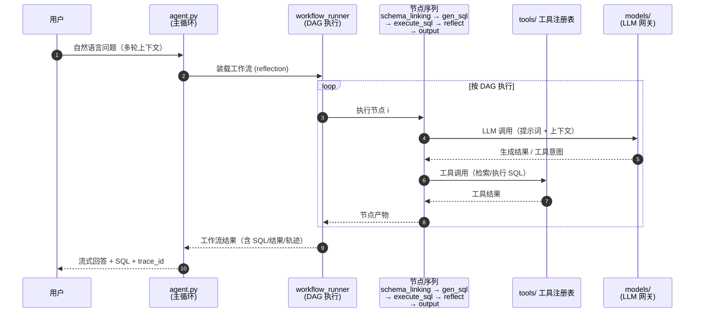

**要点**：
- 节点产物显式结构化（Pydantic，`schemas/`），节点间以产物契约解耦，`parallel`/`selection`/`subworkflow` 控制节点不感知业务。
- reflect 节点持有"重入 gen_sql 有限次数"的策略（FR-002），防止无界循环。
- 工具调用统一经 `tools/registry` 注册与 `middleware` 拦截（权限、追踪、脱敏），Agent 不直接碰驱动/HTTP 客户端。

### 6.2 语义层与指标计算

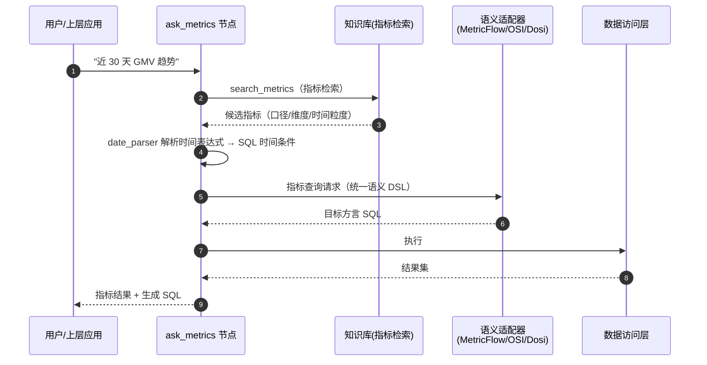

**要点**：
- 指标口径由语义模型定义，同一指标多次查询 SQL 生成一致（NFR-ACC-05）。
- 工作流 `metric_to_sql`（`schema_linking → search_metrics → date_parser → gen_sql → execute_sql → output`）是语义查询的专用编排（DRD-01 FR-012）。
- 语义适配器把统一查询翻译为各引擎 DSL 并回填 SQL（FR-014）。

### 6.3 SQL 生成与安全执行

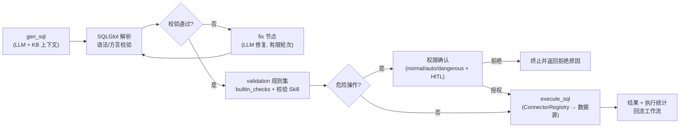

**要点**：
- 生成即校验（FR-021）：语法树级解析在前，质量规则在后，修复链路有轮次上限。
- 执行统一经 ConnectorRegistry（Guardrails：不直接 import 数据库驱动），权限确认结果按 `config_mutable` 决定是否持久化（FR-023、C4）。
- 执行可中断（`/stop_execute`，FR-022），长查询不阻塞工作流。

### 6.4 向量检索与混合检索

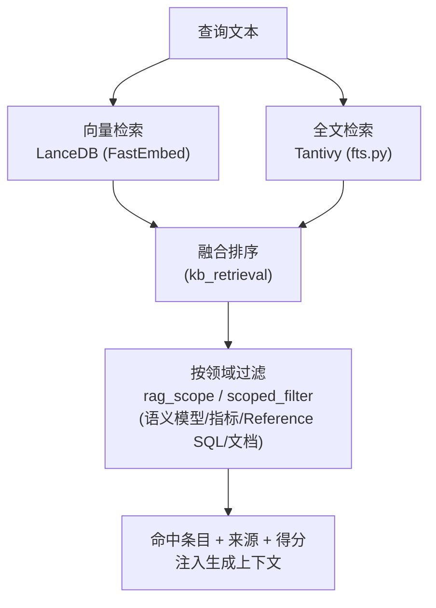

**要点**：
- 混合检索覆盖"语义相似"与"关键词精确"两类召回（FR-041）；全文对表名/字段名/术语类查询更优。
- 领域隔离：检索范围按项目（`data/{project_name}/`）与领域（`rag_scope`、`scoped_filter`）收敛，防止跨项目/跨域知识污染（FR-040 设计说明）。
- 检索是生成上下文的第一入口：`schema_linking` 选表、`search_metrics` 选指标、`search_reference_sql` 选模板，各自独立存储模块（`storage/schema_metadata`、`metric`、`reference_sql`）。

### 6.5 会话与上下文管理

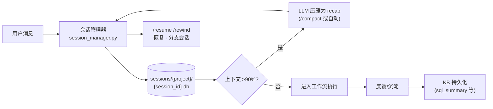

**要点**：
- 会话是一等公民（可枚举、压缩、分支、删除，FR-102），按项目分片（FR-100）。
- 上下文压缩在 >90% 阈值自动触发，由模型生成 recap 摘要（FR-005）。
- 会话级模型管理（`models/session_manager.py`）：同一会话可切换模型/Subagent 而不丢历史。
- 知识沉淀闭环：查询 → SQL Summary（FR-042）→ `/session-summarize` 落持久化 → `/memory-organize` 审计。

### 6.6 调度与任务执行

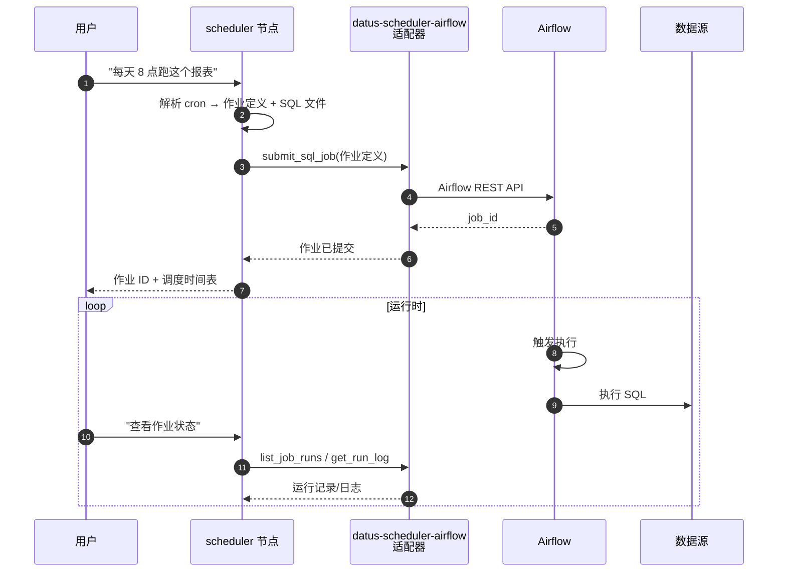

**要点**：
- 作业生命周期（提交/触发/暂停/恢复/更新/删除/监控）经 12 个调度工具 + filesystem 工具写 SQL 文件（FR-050）。
- 调度器选择顺序：显式 service_name → 项目钉选 → 全局 default → 单实例捷径（FR-051）。
- `datus-scheduler-airflow` 为可选包：未配置时调度能力不可用，其余功能不受影响（NFR-EXT-06）。

### 6.7 可观测性（OpenTelemetry Tracing）

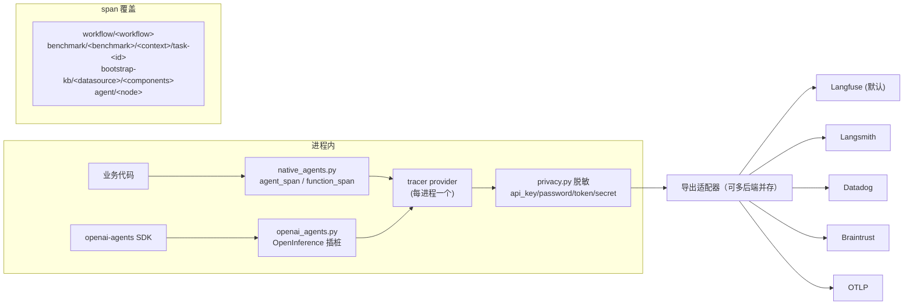

**要点**：
- span 覆盖工作流级 → 节点级，一次查询可还原完整路径（FR-090）。
- 启用开关与 API key 分离（`tracing.enabled: true` 才开启，FR-090 设计说明）。
- `capture.*` 开关（prompts/responses/reasoning/tool_args/tool_results/sql/artifacts）显式控制采集范围；脱敏在任何导出路径前执行（FR-092）。
- 本地调试：REPL Ctrl+O 详细追踪、`--save_llm_trace` 落盘 `trajectory/`（含 trace_id 关联）。

---

## 7. 数据架构

```mermaid
flowchart TB
    subgraph 项目内
        P1["{project_root}/subject/<br/>semantic_models/{datasource}/ · sql_summaries/<br/>(YAML 源文件, 随 git 版本管理)"]
        P2["./.datus/config.yml<br/>白名单键: target / default_datasource<br/>/ project_name / scheduler"]
        P3["./.datus/skills/ 项目级技能(优先)"]
    end
    subgraph 全局 ~/.datus
        G1["conf/agent.yml · .mcp.json"]
        G2["sessions/{project}/{session_id}.db"]
        G3["data/{project}/datus_db/<br/>LanceDB + Tantivy 索引"]
        G4["skills/ · plugins/ · logs/ · run/<br/>workspace/ · save/ · trajectory/<br/>benchmark/ · template/"]
    end
    P1 --> G3
    P2 --> G1
```

**数据流**：语义资产（YAML）→ Bootstrap 向量化 → LanceDB/Tantivy → 检索命中 → 生成上下文；会话（sessions db）→ 压缩摘要/知识沉淀 → 持久化存储（FR-042/100）。

**隔离维度**（FR-100/101）：项目级（`{project_name}` 规范化命名，长路径 md5）＋ 用户级（`X-Datus-User-Id`）。

---

## 8. 安全架构

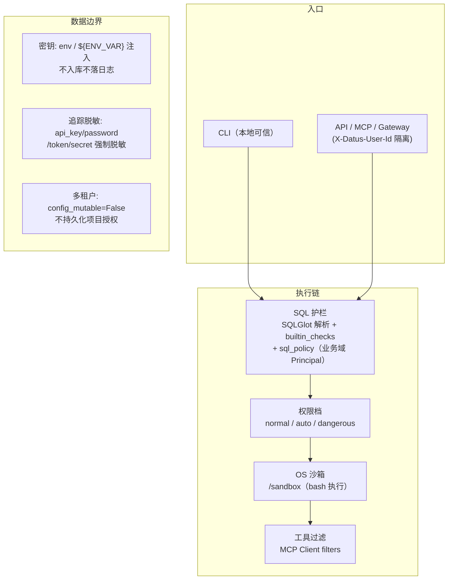

| 威胁 | 防线 | 引用 |
|---|---|---|
| SQL 注入/误写 | SQLGlot 语法树校验 + 危险操作授权 + 权限档 | FR-021/023、NFR-SEC-01/03 |
| 凭据泄漏 | `${ENV_VAR}` 注入、追踪全路径脱敏（fail-safe 默认全脱敏） | C5、FR-092 |
| 跨租户越权 | `X-Datus-User-Id` 隔离、`config_mutable=False` 禁持久化授权、SQL 策略业务域 | FR-101、C4 |
| 工具滥用/攻击面 | MCP Server 默认只读+检索工具；MCP Client filter 白/黑名单 | FR-072/073 |
| 供应链 | 技能包权限配置、Town Skills Marketplace 管控、可选包隔离 | NFR-SEC-06 |
| 未知命令/沙箱逃逸 | OS 级 bash 沙箱开关（on/off/strict/normal） | FR-063 |

---

## 9. 可扩展性与高可用设计

### 9.1 扩展点总览

| 扩展点 | 机制 | 增量成本 | 引用 |
|---|---|---|---|
| 新增 Node | 继承 `Node`/`AgenticNode` + `node_type.py` 注册 + `Node.new_instance()` 工厂映射 | 1 个类 + 2 处注册 | NFR-EXT-01 |
| 新增 LLM Provider（已有接口） | `conf/providers.yml` 加条目（凭据 + 可选 model_specs） | 零代码 | NFR-EXT-02 |
| 新增 LLM 模型（新 SDK） | `models/` 新文件继承 `LLMBaseModel` + `MODEL_TYPE_MAP` 注册 | 1 个适配文件 | NFR-EXT-02 |
| 新增数据源 | 适配器层接入（`datus-db-core`） | 1 个适配器 | NFR-EXT-03 |
| 新增语义引擎 | 语义适配器（MetricFlow/OSI/Dosi 模式） | 1 个适配器 | NFR-EXT-04 |
| 新增工具 | `datus/tools/func_tool/` 函数 + 注册表注册 → 自动进 MCP | 1 个函数 | NFR-EXT-05 |
| 新增 BI 平台 | `datus-bi-*` 适配包 | 1 个可选包 | NFR-EXT-06 |
| 新增 Skill | SKILL.md 技能包（全局/项目级两级安装） | 1 个包目录 | NFR-SEC-06 |

### 9.2 高可用与容错设计

- **可选依赖降级**：`datus-bi-*`、`datus-scheduler-airflow` 缺失时对应能力禁用，核心链路不受影响（NFR-EXT-06）——服务端可裁剪部署面。
- **导出旁路**：可观测性导出失败静默降级，不进入业务请求路径（FR-090 异常）。
- **单后端故障隔离**：多追踪后端并存，单一后端故障不影响其他（FR-091）。
- **可中断性**：SQL 执行/知识库构建/对话生成均支持停止或取消（FR-022/040/004）。
- **构建可续**：KB Bootstrap 中断后已构建部分保留可续建（FR-040）。
- **会话可恢复**：会话持久化 + `/resume` + `/rewind` 分支，进程重启不丢历史（FR-005/102）。
- **部署形态权衡**：形态 A 单进程无高可用；形态 B 多进程共享数据目录，当前设计不提供内置集群/多写一致性——多副本水平扩展为演进方向（§10）。

---

## 10. 风险与演进

| 风险 | 影响 | 缓解/演进方向 |
|---|---|---|
| LLM 成本随 reflection 工作流上升 | 长链路 token 消耗 | 工作流按场景选型（fixed/dynamic）；`capture.*` 控制观测成本；Benchmark 度量收益是否值得 |
| SQL 准确性存在边界（复杂多表/方言怪癖） | 查询失败或错结果 | 校验前置 + fix 修复 + SQL Summary 沉淀 + Benchmark 持续度量（NFR-ACC） |
| 适配器维护成本（BI/语义/调度随外部平台 API 演进） | 集成漂移 | 适配器隔离 + 可选包独立发布节奏 + 连通性 test 端点（`/config/.../test`） |
| KB 冷启动期检索质量低 | 生成准确率低 | Bootstrap 组件化 + Dashboard Copilot 复用存量 BI 资产（FR-082）+ 人工 SQL Summary 沉淀 |
| 多租户安全依赖前置认证 | 生产多租户风险 | 网关层 SSO 集成（`datus/auth` OAuth 能力）+ `config_mutable=False` 只读配置 |
| 嵌入式 LanceDB 的服务端扩展性 | 形态 B 数据面容量 | 共享网络盘/对象存储；演进评估分布式向量库（保持 `storage/registry` 后端抽象） |
| 会话上下文压缩的信息丢失 | 长对话答非所问 | `/rewind` 分支保留原始轨迹；压缩阈值可配 |
| openai-agents SDK 内部结构变化 | OpenInference 插桩脆弱性 | 插桩层收敛在 `observability/openai_agents.py` 单点，SDK 升级时定点适配 |

---

*（本文档基于仓库真实代码与官方文档编写；未验证细节一律不写入。模块路径、节点数量、端点、配置项均以 `datus/` 源码与 `docs/` 站点为准，与 DRD-01 保持一致引用。）*
