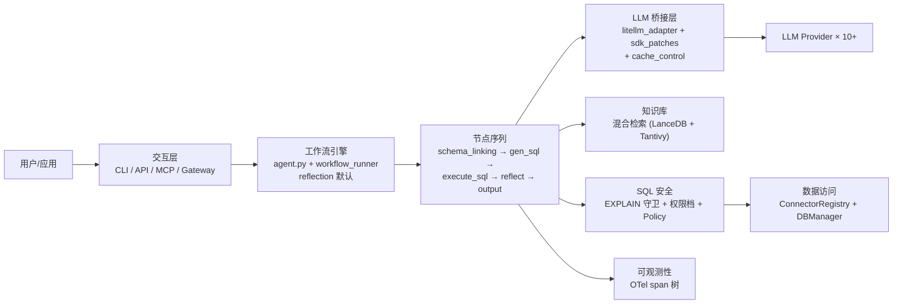
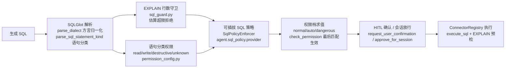
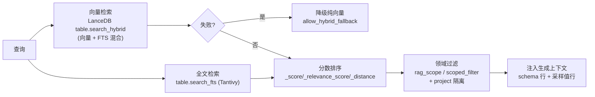

# Datus 智能数据代理（Data Agent）技术方案

> **文档编号**：DRD-03
> **版本**：0.1（草稿）
> **状态**：评审中
> **适用产品**：Datus（智能数据代理 / Data Agent，开源数据工程 Agent）
> **编写基准**：以仓库真实实现为准（关键文件已核对：`datus/models/litellm_adapter.py`、`datus/models/sdk_patches.py`、`datus/prompts/gen_sql.py`、`datus/tools/sql_guard.py`、`datus/tools/sql_policy.py`、`datus/tools/permission/profiles.py`、`datus/storage/kb_retrieval/store.py`、`datus/observability/manager.py` 等）
> **依赖文档**：DRD-01《需求规格说明书》、DRD-02《架构设计文档》

> **声明**：本文档描述"系统实际怎么做"。凡与背景描述不一致处，一律以代码为准——例如：SQLGlot 在本项目用于**解析/方言归一化/语句分类**，不用于跨方言 SQL 翻译生成；SQL 安全采用 **EXPLAIN 行数守卫 + 权限档**而非关键词黑名单；提示词不使用 few-shot 注入，而以**模板检索（Reference SQL/模板工具）**替代。

---

## 1. 方案目标与范围

### 1.1 目标

- 交付一个**可落地、可指导开发**的技术方案：每个核心机制给出真实实现路径（关键文件 + 核心参数 + 流程），而非概念描述。
- 明确每个选型的 tradeoff，供评审决策。
- 对齐 DRD-01 的 P0 需求（对话闭环、SQL 生成与安全执行、知识库、多数据源、API/MCP）与 P1 增强（语义层、调度、可视化、可观测性深度）。

### 1.2 范围

| 覆盖 | 不覆盖 |
|---|---|
| Agent 编排与模型路由、SQL 全链路、混合检索、多数据源、调度、交互（TUI/API/MCP）、可观测性、性能与成本、安全、测试上线 | LLM 训练、数据库引擎内部、Airflow 内部、MetricFlow/OSI/Dosi 引擎内部、前端业务站点 |

---

## 2. 总体技术方案

一句话总结：**"结构化 Node 工作流 + Agentic 节点自由循环"的混合编排**，LLM 调用统一经 **LiteLLM 桥接层**（SDK 适配 + 缓存控制 + reasoning 补丁），知识经 **LanceDB 向量 + Tantivy 全文混合检索**注入生成上下文，SQL 经 **"EXPLAIN 行数守卫 + 语句分类权限 + 可插拔策略"三道防线**后统一由 ConnectorRegistry 执行，全链路由 **OpenTelemetry + OpenInference** 追踪。



---

## 3. 核心技术方案详细设计

### 3.1 Agent 编排方案（openai-agents + LiteLLM 多模型路由）

#### 3.1.1 方案构成

| 组件 | 实现 | 职责 |
|---|---|---|
| Agent 主循环 | `datus/agent/agent.py`（plan → execute → reflect） | 工作流级编排 |
| 节点执行 | `datus/agent/workflow_runner.py` + `node_factory.py` | DAG 执行与节点构建 |
| 节点基类 | `datus/agent/node/node.py`（Node / AgenticNode） | 节点契约（输入/输出 Pydantic 产物） |
| SDK 桥接 | `datus/models/litellm_adapter.py` | OpenAI Agents SDK ↔ LiteLLM 三路路由 |
| SDK 补丁 | `datus/models/sdk_patches.py` | reasoning 回填、Kimi 模型名规范化、流式 reasoning 捕获 |
| 缓存控制 | `datus/models/litellm_cache_control.py` | Anthropic prompt caching 断点注入 |
| 模型注册 | `datus/models/base.py`（`MODEL_TYPE_MAP` :32，LRU 缓存 maxsize=4） | Provider → 模型类映射与实例复用 |

#### 3.1.2 模型路由机制（`litellm_adapter.py`）

**模型名归一化**：`MODEL_PREFIX_MAP`（:131）按 provider 加前缀：claude→`anthropic/`、deepseek→`deepseek/`、qwen→`dashscope/`、kimi→`moonshot/` 等；自定义 base_url 的非官方 OpenAI host 加 `openai/` 走 OpenAI 兼容格式（:329）。

**自动探测**（`_detect_provider_from_model` :227）：配置 provider=openai 但模型名是 `kimi-k2.5` 时，按 `MODEL_NAME_PREFIXES` 自动路由到 kimi；用 `PROVIDER_DOMAINS` 校验 base_url 域名，不匹配或路径含 `/coding/` 等协议关键字时跳过探测（:188）。

**SDK 模型三路路由**（`get_agents_sdk_model` :384）：

| 分支 | 条件 | 选用模型 |
|---|---|---|
| 官方 OpenAI | `is_official_openai_endpoint`（:56） | `OpenAIResponsesModel`（Responses API —— chat/completions 拒绝 `reasoning_effort` + function tools 组合） |
| Claude | 模型名 `anthropic/` 前缀 | `CacheControlLitellmModel`（带缓存断点） |
| 其他 | DeepSeek/Kimi/Qwen/Gemini/OpenRouter/GLM/MiniMax/vLLM 等 | `LitellmModel` |

**思考模式**：`reasoning_effort_level`（:341）优先级 `reasoning_effort` > `enable_thinking`(=medium) > off，取值 off/minimal/low/medium/high；`NON_THINKING_MODEL_RULES`（:50）deny-list 判断 DeepSeek/Kimi 非思考型号（支持 `*` 前缀匹配，`is_known_non_thinking_model` :94）。

**SDK 补丁（`sdk_patches.py`）**：`apply_sdk_patches`（:671）初始化早期打三类 monkey patch——① 消息转换器：Kimi/Moonshot 模型名规范化为 `deepseek-` 前缀以复用 DeepSeek reasoning 逻辑、Chat 风格 `text` block 规范化（:556/:108）；② `litellm.acompletion` 包装（:704）：调用前把 reasoning_content 回注入带 tool_calls 的 assistant 消息（DeepSeek/Kimi 要求），流式用 `_ReasoningContentStreamWrapper`（:428）从 delta 捕获；③ 同步 `litellm.completion` 包装（:747，Kimi 空 content 时注入 reasoning_content）。

**Prompt caching（`litellm_cache_control.py`）**：`CacheControlLitellmModel`（:120）重写 `_fetch_response`（:132），仅当模型名 `anthropic/` 开头时设置 per-task ContextVar（:32）；模块导入时一次性包装 `litellm.acompletion`（`_install_cache_control_wrapper` :87）。`apply_cache_control`（:51）注入最多 **3 个 `{"type":"ephemeral"}` 断点**：system 首条消息、最后一条 user/tool 消息的最后一个 block、最后一条 tool 定义——对齐 Anthropic 缓存策略。

**设计 tradeoff**：

- **三路路由而非统一通道**：官方 OpenAI 走 Responses API（获得 reasoning + tools 完整支持）、Claude 走带缓存包装的 LiteLLM、其余走通用 LiteLLM。代价是路由分支多、需随 SDK 演进维护（收敛在 `litellm_adapter.py` 单点）。
- **monkey patch 换取兼容**：DeepSeek/Kimi 的 reasoning 返回格式差异靠补丁层吸收，避免改业务代码；代价是对 SDK 内部结构的脆弱性，升级 SDK 时补丁需定点回归。
- **缓存断点只给 Anthropic**：其他 provider 无等价的 ephemeral 缓存协议；断点上限 3 个是缓存命中率与请求体积的平衡点。
- **无自动降级**：当前未实现"主模型失败自动切换备用模型"（代码中未找到）——这是明确的演进项（见 §9）。

#### 3.1.3 LLMBaseModel 契约（`datus/models/base.py`）

核心接口：`generate(prompt, enable_thinking=False, **kwargs) -> str`（:130）、`generate_with_json_output -> Dict`（:144）、`generate_with_tools`（:157）、`generate_with_tools_stream`（:185）、`set_context(workflow=None, current_node=None)`（:219，工作流上下文注入）、`token_count`（:245）、`context_length`（:249）、`test_connection(timeout=10.0)`（:260）。`create_model`（:65）按配置指纹（type/model/base_url/api_key digest/auth_type/scope/thinking 参数）LRU 缓存实例（maxsize=4）。

**设计要点**：`set_context` 让模型层感知"当前节点"，节点级可观测性与提示词注入都挂在这个钩子上；`test_connection` 支撑 `/config/models/test` 端点的连通性先验（DRD-01 FR-071）。

---

### 3.2 语义层与 BI 查询方案（datus-semantic-core / datus-bi-core）

#### 3.2.1 方案构成

| 层 | 实现 | 职责 |
|---|---|---|
| 指标检索 | `storage/metric/` + `search_metrics` 节点/工具 | 自然语言 → 候选指标 |
| 时间解析 | `date_parser` 节点（`prompts/extract_dates.py`） | "近 30 天" → SQL 时间条件 |
| 语义适配 | `datus-semantic-core` + 适配器（MetricFlow/OSI/Dosi） | 指标查询 → 各引擎 DSL → 目标方言 SQL |
| 指标管理 | `/subject/metric` API + `subject/semantic_models/` | 指标 CRUD、预览（先算后存） |
| BI 集成 | `datus-bi-core` + `datus-bi-superset`/`datus-bi-grafana` + `tools/bi_tools` | 仪表盘 CRUD、Dashboard Copilot（`/bootstrap-bi`） |

#### 3.2.2 指标查询主路径

`metric_to_sql` 工作流：`schema_linking → search_metrics（指标检索）→ date_parser（时间解析）→ gen_sql → execute_sql → output`。

**关键设计**：

- 指标口径由语义模型定义，查询生成与口径绑定（NFR-ACC-05）；`date_parser` 是自然语言时间表达式的专用精度点，独立成节点可被其他工作流复用。
- 语义适配器把统一查询翻译为 MetricFlow/OSI/Dosi 的 DSL 并回填 SQL（FR-014）；适配器边界 = 语义引擎差异的隔离点。
- BI 侧：`gen_dashboard` 节点对接 Superset/Grafana 做 CRUD；`/bootstrap-bi` 提取存量仪表盘资产入知识库，实现"存量 BI → 会话式分析"。

**设计 tradeoff**：语义层用"一次定义、处处复用"换取口径一致与生成准确；代价是语义模型需随 schema 演进同步维护，且适配器需随引擎 API 演进。覆盖不到的查询回退原生 SQL——两条路径并存而非互斥。

---

### 3.3 SQL 生成与执行方案（SQLGlot + DuckDB + 安全执行链）

#### 3.3.1 SQL 生成（`datus/prompts/gen_sql.py`）

`get_sql_prompt`（:18）返回 `[system, user]` 两段消息，经 `prompt_manager` 的 Jinja2 模板渲染（`prompt_version` 参数切换模板版本，`prompt_templates/`、`prompt_templates_zh/` 双语）：

- **上下文截断策略**（硬上限，:27-31）：schema 4000 字符、data details 2000、context 8000、单值 500、文本标记 16 —— 防止 prompt 爆炸的确定性护栏。
- **能力章节动态开关**：`gen_sql_system_1.2.j2` 顶部按注入的 `available_tool_names` 用 `` 动态开/关——澄清（ask_user）、参考模板优先（search_reference_template/execute_reference_template）、上下文搜索（metrics/reference_sql/semantic_objects/subject_tree）、MetricFlow 路径（list_metrics/query_metrics）、平台文档验证、SQL 生成约束（"只生成所需列、不编造表名列名、优先 CTE"）、SQL 验证（用 execute_sql 验证）。
- **无 few-shot 注入**：以"参考 SQL/模板检索工具"替代——检索命中即把真实可用的 SQL 形态交给模型。

**修复与反思**：

- `fix_sql.py`：`fix_sql_prompt`（:15）把 sql_task/sql_context/docs/schemas 渲染进 user 消息，交由 LLM 修复（DRD-01 FR-021）。
- 反思循环：`evaluate.py` `evaluate_with_model`（:16）用 `generate_with_json_output` 让 LLM 打分，取 `classification` 字段并校验在 `STRATEGY_LIST` 中（否则 "UNKNOWN"，:52-55）；`reflect.py` `evaluate_result`（:46）做工作流级编排（`update_context_from_node` → `get_next_node` → `setup_node_input`），节点级反思在 `reflect_node.py`。评估模板有 evaluation_1.0/2.0/2.1 三版可演进。

#### 3.3.2 SQL 执行安全链（关键：不是关键词黑名单）



**① EXPLAIN 行数守卫（`datus/tools/sql_guard.py`）**：不是关键词黑名单，而是**执行前 EXPLAIN 估算**。`MAX_ESTIMATED_ROWS = 50_000_000`（:52）；按方言正则解析执行计划——StarRocks/Doris `cardinality: N`（:58）、DuckDB `EC: N`（:61）、Postgres/Redshift 各节点 `rows=` 最大值（:66）、MySQL 各表 rows 相乘（:87）。`estimate_rows_from_explain`（:110）解析失败返回 None 即 **fail-open**（:41-42）。调用点 `func_tool/database.py:1605-1644`：execute_sql 前先跑 EXPLAIN，超限用 `build_oversize_message`（:135）拒绝并给出**改写建议**（加过滤/分页/拆查询）。

**② 可插拔策略（`datus/tools/sql_policy.py`）**：`SqlPolicyEnforcer` Protocol（:64）只要求 `enforce_read(sql, *, datasource, dialect, principal) -> EnforcementResult`；`load_sql_policy_enforcer`（:98）按 `agent.sql_policy.provider="package.module:ProviderClass"` 动态加载，默认 `NoopSqlPolicyEnforcer`（:83）。`principal` 来自 `X-Datus-Principal` 头（DRD-01 FR-101）。

**③ 语句分类与权限档（`permission/`）**：

- 分类：`sql_utils.parse_sql_statement_kind`（:765）用 SQLGlot 解析 + 首关键字细分（select/metadata/explain/insert/replace/create/ddl/context_set/update/delete/merge/drop/truncate/alter/unknown）；`permission_config.py` `_SQL_KIND_TO_CLASS`（:85-106）映射为 **read/write/destructive/unknown** 四类，`SqlStatementRules`（:118）每类一个 PermissionLevel（read 默认 ALLOW，其余 ASK，:138-148）。
- 三档（`profiles.py` `PROFILE_NAMES = ("normal","auto","dangerous")` :58）：**normal** 只读 ALLOW、写 ASK、命名危险工具 DENY、SQL 读 auto-allow 其余 ASK；**auto** 工作区写/BI 写/非破坏性 SQL 写自动放行；**dangerous** 全 ALLOW（含外部文件系统路径）。
- 求值（`permission_manager.py` `check_permission` :207）：默认值起算 + 全局规则 + 节点覆盖规则**顺序求值、最后匹配生效，同特异性 DENY 优先**（:219）；`_rule_matches`（:246）用 `fnmatch` glob；`filter_available_tools`（:273）把 DENY 工具**完全从 system prompt 隐藏**（模型根本看不到，而非看到后拒绝）。
- 拦截点（`permission_hooks.py` `PermissionHooks(AgentHooks)` :243）：`on_tool_start`（:341）拦截，`_handle_sql_permission`（:778）按语句类别门控，`_request_sql_confirmation`（:990）弹确认。
- 持久化：`approve_for_session`（:375）会话级放行；项目级授权按 `config_mutable` 决定是否写 `./.datus/config.yml`（C4）。

**设计 tradeoff**：

- **EXPLAIN 守卫 vs 黑名单**：行数估算拦截"跑出来才发现的巨型结果"，比关键词判断更接近真实风险；代价是依赖 EXPLAIN 输出格式（各方言正则维护），且解析失败 fail-open（宁放过不可误杀——业务正确性优先于严格性）。
- **DENY 隐藏而非提示**：把禁用工具从 system prompt 移除，比"模型看到工具后被拒"更省 token 且更确定性；代价是模型无法对禁用工具做出解释性回应。
- **最后匹配生效**：规则可精确叠加（节点级覆盖全局），代价是规则调试需理解求值顺序。

#### 3.3.3 执行通道

统一经 `datus_db_core.ConnectorRegistry`（Guardrails：禁止直接 import 数据库驱动）；DuckDB/SQLite 内置注册（`db_tools/__init__.py` `_register_builtin_connectors` :22，duckdb 带 `capabilities={"database","schema"}`），插件适配器经 `discover_adapters`（:61）发现。执行可中断（`/stop_execute`）。SQLGlot 在本项目的定位是**解析/方言归一化/语句分类**（`sql_utils.py`：`parse_dialect` :40、`parse_metadata_from_ddl` :53、`extract_table_names` :131），不承担跨方言翻译生成——方言差异由各适配器承接。

---

### 3.4 向量检索与知识增强方案（LanceDB + FastEmbed + Tantivy）

#### 3.4.1 检索链路



#### 3.4.2 关键实现

- **嵌入**（`storage/fastembed_embeddings.py`）：`FastEmbedEmbeddings`（:22）实现 `EmbeddingFunction`，默认 `sentence-transformers/all-MiniLM-L6-v2`，device CPU/CUDA（`get_embedding_device`），batch_size 256；模型进程级 LRU 缓存一次加载（:112）；`check_snapshot`（:154）先 `local_files_only=True` 检查再走 huggingface_hub 下载——离线可用优先。
- **混合检索**（`storage/base.py` `search` :581）：`query_type="hybrid"` → `_search_hybrid`（:610）调 LanceDB `table.search_hybrid`（:621），异常时按 `allow_hybrid_fallback` 降级为纯向量（:633）。**RRF 融合排序在 LanceDB 内部实现**，本仓库按返回分数排序（`SCORE_FIELDS = ["_score","_relevance_score","_distance"]`，`kb_retrieval/store.py:453`）。
- **高层检索**（`kb_retrieval/store.py` `MetadataFtsRAG` :432）：`search_table`（:596）FTS 搜文档表（`KbRetrievalDocumentStore.FTS_SPEC`）、`search_similar`（:632）把命中拼成 **schema 行 + 采样值行**、`search_tables`（:713）按表名精查 facts_store；`refresh_tables/refresh_profiles`（:836/:817）物化缓存。
- **后端持有**（`storage/backend_holder.py`）：全局单例；`init_backends`（:35）启动时配置，`_get_rdb_backend`（:77）懒初始化 `RdbRegistry.create_backend(cfg.rdb.type)`，默认 **sqlite+lance**；项目作为物理隔离路径组件，一个后端实例服务多项目。
- **存储注册**（`storage/registry.py`）：`get_storage`（:93）按 (factory, embedding_model, project, datasource_id) LRU 缓存（maxsize 256）；`configure_storage_defaults`（:39）注入部署级默认；`preload_all_storages`（:128）一站式初始化。

**设计 tradeoff**：

- **混合 vs 纯向量**：全文对表名/字段名/术语精确查询更强，向量对语义近似更强；混合召回提升生成上下文质量，代价是双索引构建/维护成本——按领域配置（语义/指标/文档各自 FTS_SPEC 与嵌入模型不同，DRD-01 §6.3）。
- **降级不阻断**：hybrid 失败自动回退纯向量，检索通道宁可降级也不让问答断链。
- **进程级模型缓存**：嵌入模型一次加载全局复用，省显存/内存；代价是多项目并发首召回的排队延迟。

---

### 3.5 多数据源统一访问方案（datus-db-core）

#### 3.5.1 方案构成

- **连接管理**（`db_tools/db_manager.py`）：`DBManager`（:193）核心方法 `get_conn(datasource, database)`（:199）、`get_connections`（:208）、`first_conn`（:224）、`get_db_uris`（:242）；懒建连 `_init_connection`（:277）/`_build_conn`（:293）——连接按需建立、按 datasource+database 缓存；模块级单例 `db_manager_instance`（:437），`set_db_manager_factory`（:418）允许替换工厂（测试注入点）。
- **内置连接器**：sqlite（零依赖）、duckdb（capabilities 声明）；`discover_adapters()` 发现插件式适配器（PostgreSQL/MySQL/Snowflake/StarRocks/ClickHouse 等由 `datus_db_core` 生态提供）。
- **方言归一化**：`sql_utils.parse_dialect`（:40）把 starrocks/doris/duckdb/postgres 等归一，供 sql_guard、语句分类共用。
- **能力探测**：`db_tools/capabilities.py` + duckdb 的 `capabilities={"database","schema"}`——上层据此决定可用操作（如多库 JOIN）。

#### 3.5.2 关键流程

```
用户配置 agent.services.datasources.<name> (YAML/环境变量注入)
  → DBManager.get_conn(datasource) 懒建连（按需，失败不影响其他数据源）
  → ConnectorRegistry 分派到对应适配器（内置或插件）
  → 元数据（表/Schema/字段）→ 知识库 schema_metadata 注册（FR-030 处理）
  → 查询经 SQL 安全链（§3.3.2）→ 适配器执行 → 统一结果集
```

**设计 tradeoff**：统一经 ConnectorRegistry 而非直连驱动——换取方言适配、权限点、追踪点的统一注入；连接懒建连省资源但首次调用有建连延迟（由 `test` 端点与 bootstrap 预热缓解）。

---

### 3.6 调度方案（datus-scheduler-core）

- **节点实现**（`node/scheduler_agentic_node.py`）：`SchedulerAgenticNode`（:27）继承 `DeliverableAgenticNode`；`setup_tools`（:80）组合领域工具 + filesystem 工具（写 `jobs/<name>.sql`）+ 可选 ask_user 工具；`_setup_domain_tools`（:92）**仅在配置了 scheduler 服务时**实例化 `SchedulerTools`（:104）——无配置则工具不可见（可选依赖降级，NFR-EXT-06）。
- **工具集**（`tools/func_tool/scheduler_tools.py`）：`SchedulerTools(BaseTool)`（:24），`available_tools`（:846）注册 12 个 FunctionTool（`submit_sql_job`、`submit_sparksql_job`、`trigger_scheduler_job`、`pause_job`、`resume_job`、`delete_job`、`update_job`、`get_scheduler_job`、`list_scheduler_jobs`、`list_scheduler_connections`、`list_job_runs`、`get_run_log`）；可用 conn_ids 以 `_connections_description()` 动态追加进 submit/update 的 tool.description（:856-866）——让模型"知道有哪些连接可选"。
- **适配**：`datus-scheduler-airflow`（唯一内置调度器）经 Airflow REST API 对接；选择顺序见 DRD-02 §6.6。

**设计 tradeoff**：调度能力做成"节点 + 可选工具集"，未配置调度器时节点仍存在但工具为空——用户不会看到任何调度痕迹；配置后工具描述动态携带可用连接，减少模型无效调用。

---

### 3.7 交互方案（Textual TUI + FastAPI + MCP）

#### 3.7.1 TUI / CLI（Textual + prompt-toolkit + rich）

- 样式集中管理（`cli/cli_styles.py`）：`TABLE_HEADER_STYLE="green"`、`TABLE_BORDER_STYLE="blue"`、`CODE_THEME="monokai"`、`STATUS_BAR_STYLE` 等常量 + `print_error/print_success/print_warning/print_info/print_status` 统一输出辅助——**交互层样式禁止散落 inline Rich 标记**（项目规范）。
- 全屏组件（`cli/model_app.py`）：prompt_toolkit 表单应用 `ModelApp`（:143），`run()`（:237）构建 KeyBindings 后 `Application.run()`；`build_embedded_panel`（:273）返回可嵌入主 TUI 的 EmbeddedWizard。约定：`tui_app.suspend_input()` 包裹、不嵌套 `asyncio.run`、DynamicContainer + Condition 守卫、`app.exit(result=Selection(...))` 退出（CLAUDE.md）。
- 命令体系：`datus/cli/slash_registry.py` 注册表（DRD-01 FR-061），三大魔法命令 `/`（聊天）、`@`（上下文注入）、`!`（工具执行）。

#### 3.7.2 FastAPI（SSE）

- 统一响应封装 `Result[T] = {success, data, errorCode, errorMessage}`；流式端点 `text/event-stream`。
- 双向控制拆为独立 POST（insert/stop/tool_result/user_interaction）——SSE 单向模型下的既定取舍（DRD-01 FR-070 设计说明）。
- 用户隔离：`X-Datus-User-Id`（`deps.py` 校验格式 `^[A-Za-z0-9_-]+$`）；`X-Datus-Principal` 承载 SQL 策略业务域。

#### 3.7.3 MCP（FastMCP）

- 工具注册双装饰器（`utils/mcp_decorators.py`）：`@mcp_tool(availability_check=...)`（:79）方法级、`@mcp_tool_class`（:71）类级，维护全局注册表。
- **动态模式**（`register_dynamic_tools` :200+）：`create_dynamic_tool_wrapper`（:130）用 `inspect.signature` 去 self 并保留 `__name__/__doc__/__signature__` 供 schema 生成，运行时从 context 取工具实例——同一 MCP server 服务多数据源（`/mcp/{datasource}`）；`create_static_tool_wrapper`（:170）为固定实例模式。
- `DatusMCPServer._register_tools`（mcp_server.py :421）按可用性（`has_db_tools` 等）注册——数据源/知识库未配置时对应工具不出现（与 §3.6 同理的降级设计）。
- 工具注册表（`tools/registry/tool_registry.py`）：`ToolRegistry`（:21）tool_name→category 映射，AgenticNode 层共享给 PermissionHooks 与 proxy 作为单一事实源。

---

### 3.8 可观测性方案

#### 3.8.1 埋点体系（`datus/observability/`）

| 机制 | 实现 | 说明 |
|---|---|---|
| 追踪管理器 | `manager.py` `ObservabilityManager`（:35）单例 | `span(name, attributes, run_id)`（:94）/`trace_baggage`（:148）为**上下文管理器**；`record_event`（:165）、`flush`（:172）、`shutdown`（:179）、`redact`（:88）、`content_enabled(field_name)`（:81）；当前/最近 trace 存 ContextVar |
| 原生 Agent span | `native_agents.py` | 对不走 `agents.Runner` 的自定义循环，用 SDK 导出对象手动管理：`trace_native_agent_stream`（:31）**装饰器**（显式 start + 处理 async generator 关闭路径，:34-37 producer/consumer 双队列 :65-125）、`start_native_generation_span`（:130）/`start_native_tool_span`（:147，function_span + mcp tool_call_id）/`finish_native_span`（:158）；`native_agents_tracing_enabled`（:26）按是否有外部 adapter 决定禁用 |
| SDK 插桩 | `openai_agents.py` | OpenAI Agents SDK span 经 OpenInference 并入追踪树 |
| 脱敏 | `privacy.py` `redact_value`（:15） | 递归：Mapping 键名命中敏感字段（`_is_sensitive_field` :45，camelCase→snake_case 归一、多段字段序列匹配）替换为 `"[REDACTED]"`；字符串按 `config.patterns` 正则替换（:36）；`RedactConfig.enabled` 总开关 |

#### 3.8.2 追踪边界

- span 覆盖：`workflow/<workflow>`、`benchmark/<benchmark>/<context>/task-<id>`、`bootstrap-kb/<datasource>/<components>`、`agent/<node>`（DRD-01 FR-090）。
- 导出适配器：langfuse（默认）/langsmith/datadog/braintrust/otlp 可并存；每进程一个 tracer provider。
- 采集开关：`capture.prompts/responses/reasoning/tool_args/tool_results/sql/artifacts`；脱敏在任何导出路径前执行（fail-safe 全脱敏兜底）。

**设计 tradeoff**：

- **手动静默管理 span vs 依赖 SDK 自动**：自定义循环不走 Runner，SDK 上下文管理器在 `GeneratorExit` 时不清 ContextVar——项目专门处理 async generator 关闭路径。这是"SDK 自由循环"与"追踪完整性"之间的代价，收敛在 `native_agents.py` 单点。
- **内容采集可开关**：`content_enabled` 让"prompts/responses 是否上送"显式化——成本与隐私交给部署方决定。

---

## 4. 关键技术难点与解决方案

| # | 难点 | 方案（真实实现） | tradeoff |
|---|---|---|---|
| 1 | **SQL 准确性** | ① schema_linking 选表 + 知识库检索注入（schema 4000/context 8000 截断护栏）；② 生成即校验（SQLGlot + builtin_checks）；③ reflect 反思循环（evaluation 模板三版可演进，classification 校验 STRATEGY_LIST）；④ SQL Summary 沉淀复用历史成功 SQL；⑤ Benchmark（BIRD/Spider2/Semantic Layer）量化度量 | 反思与修复有轮次上限，防无界 token 消耗 |
| 2 | **幻觉控制** | ① 提示词硬约束（"不编造表名列名"、"只生成所需列"）；② 参考模板工具优先（检索命中真实 SQL 形态）；③ 无 few-shot 注入、以模板检索替代；④ SQL 执行前 EXPLAIN + 校验拦截幻觉产物；⑤ knowledge_provenance 溯源（命中条目带来源） | 模板检索的覆盖面决定上限；冷门查询依赖兜底链路 |
| 3 | **长上下文** | ① 硬截断上限（schema/details/context 逐段限额）；② 会话压缩（>90% 自动 /compact）；③ 检索只注入命中条目而非全量 schema；④ Anthropic ephemeral 缓存断点（≤3 个）降成本 | 截断会丢细节，压缩有信息损失，靠 /rewind 分支保留原始轨迹 |
| 4 | **权限与安全** | ① EXPLAIN 行数守卫（50M 上限，方言正则）；② 语句分类 read/write/destructive/unknown；③ 三档权限档 + DENY 工具从 prompt 隐藏；④ 可插拔 SqlPolicyEnforcer；⑤ 追踪全路径脱敏 | fail-open 策略宁可放过；最后匹配生效需理解求值顺序 |
| 5 | **性能** | ① SSE 流式首响应；② 连接懒建连 + 存储 LRU（registry 256 / 模型 4 / 嵌入进程级）；③ 检索降级不阻断；④ 执行可中断；⑤ 嵌入模型本地推理（FastEmbed） | 懒建连首调用延迟；进程级模型缓存的首召回排队 |
| 6 | **多 Provider 兼容** | ① 三路路由（Responses/Claude 缓存/通用 LiteLLM）；② sdk_patches 吸收 DeepSeek/Kimi reasoning 差异；③ 自动 provider 探测（模型名前缀 + 域名校验）；④ 非思考模型 deny-list | monkey patch 对 SDK 内部结构脆弱；无自动降级是演进项 |

---

## 5. 第三方依赖与版本策略

| 依赖 | 定位 | 版本策略 |
|---|---|---|
| openai-agents SDK | Agent 编排核心 | 锁定版本 + sdk_patches 定点适配；升级走回归（observability/openai_agents.py 单点收敛） |
| litellm | 多 Provider 网关 | 跟随发布；`LITELLM_LOCAL_MODEL_COST_MAP` 本地成本映射维护 |
| sqlglot | SQL 解析/分类/方言归一化 | 稳定依赖，仅用解析层 API |
| lancedb + tantivy | 向量 + 全文 | 经 `datus-storage-base` 抽象（fts.py 即其回退导出）；后端可替换 |
| fastembed | 本地嵌入 | 模型文件版本固定（snapshot 检查）；支持 OpenAI 嵌入备选（embedding_openai.py） |
| duckdb / sqlalchemy | 内置分析引擎 / ORM | sqlite+duckdb 为默认 rdb+vector 后端（backend_holder 默认） |
| datus-* 核心包 | 语义/BI/DB/存储/调度 | 独立发布；跨包接口变更版本协同（DRD-02 §3.2） |
| datus-bi-superset / datus-bi-grafana / datus-scheduler-airflow | 可选能力 | 可选安装，缺失时能力禁用（NFR-EXT-06） |
| pydantic | 数据结构 | schemas/ 全量 Pydantic 模型，版本跟随生态 |

**锁定原则**：`uv.lock` 全量锁定；SDK 与补丁耦合的依赖（openai-agents、litellm）需人工回归清单。

---

## 6. 性能与成本优化

| 优化项 | 手段 | 引用 |
|---|---|---|
| Token 成本 | 工作流按场景选型（fixed 无反思 / reflection 自纠）；DENY 工具从 prompt 隐藏；检索只注入命中；Anthropic ephemeral 缓存 ≤3 断点；capture.* 控观测采集 | FR-002、§3.3.2、§3.1.2 |
| 延迟 | SSE 流式；嵌入本地推理；存储/连接/模型三级 LRU 缓存；检索降级不阻断 | NFR-PERF |
| 资源 | 连接懒建连；嵌入模型进程级单实例；LanceDB 物化缓存（refresh_tables） | §3.4/3.5 |
| 质量成本比 | Benchmark 度量"多花 token 是否换来准确率"（对比 fixed vs reflection）；失败分类（Table/Row Count/Column Value Mismatch）定位优化方向 | NFR-ACC-01 |

---

## 7. 安全与合规

| 域 | 措施 | 引用 |
|---|---|---|
| SQL 安全 | EXPLAIN 守卫 + 语句分类 + 权限档 + Policy 扩展点 + HITL | §3.3.2、NFR-SEC-01/03 |
| 凭据 | `${ENV_VAR}` 注入、追踪全路径脱敏（`[REDACTED]`，fail-safe）、不入库不落日志 | C5、FR-092 |
| 多租户 | `X-Datus-User-Id` + `config_mutable=False` 禁持久化授权 + SQL 策略业务域（principal） | FR-101、C4 |
| 工具面 | MCP Server 只读+检索默认；MCP Client filter；DENY 工具隐藏 | FR-072/073 |
| 供应链 | 技能包权限配置 + 市场管控 + 可选包隔离 | NFR-SEC-06 |
| 合规 | Apache-2.0、无闭源运行时、本地优先存储 | C1/C2 |

---

## 8. 测试与上线策略

| 阶段 | 手段 |
|---|---|
| 单元测试 | `tests/unit_tests/` 镜像源码路径；全 Mock 外部调用（LLM/DB/网络）；`set_db_manager_factory` 等注入点支撑测试替换 |
| 集成测试 | `tests/integration/`：CLI 命令、MCP server、func_tools DB 等跨组件契约 |
| 回归/夜间 | `@pytest.mark.nightly`（真实 LLM）、`@pytest.mark.regression`（真实服务，缺 Key skipif 跳过） |
| 质量门禁 | PR 验收 harness（`ci/run-pr-tests.py`）+ 测试审计 P0=0 + 覆盖率/diff 覆盖率审查 |
| 上线策略 | 三形态部署（DRD-02 §4）；服务端形态前置网关认证；配置经 AgentConfig 注入可设只读；`/config/.../test` 连通性先验；`/health` 探活 |

---

## 9. 方案对比与演进

### 9.1 关键决策对比

| 决策点 | 本项目选型 | 备选 | 为何不选备选 |
|---|---|---|---|
| 编排形态 | Node DAG + Agentic 自由循环 | 纯自由 Agent / 纯固定流水线 | 纯自由不可观测不可控；纯固定无自适应 |
| 模型通道 | SDK 三路路由 + 补丁 | 全走原生 SDK / 全走 LiteLLM | 全原生锁厂商；全 LiteLLM 丢 reasoning 细节 |
| SQL 安全 | EXPLAIN 守卫 + 分类权限 | 关键词黑名单 / 正则白名单 | 黑名单可绕过且误伤；EXPLAIN 更贴近真实风险 |
| 检索 | LanceDB 混合（hybrid + fallback） | 纯向量 / 外部 ES | 混合召回更全；嵌入式免运维 |
| 知识注入 | 模板检索替代 few-shot | 静态 few-shot 注入 | 模板检索随库演进，few-shot 静态过期 |
| 调度 | 复用 Airflow | 自研调度器 | 成熟生态 vs 重复造轮子 |
| 可视化 | 自包含 HTML + BI 平台并存 | 仅 BI 平台 | 自包含零依赖易分发，BI 平台复用存量 |
| 语义引擎 | 多适配器（MetricFlow/OSI/Dosi） | 绑定 MetricFlow | 防锁定，代价是适配维护 |

### 9.2 明确演进项（当前代码未实现）

1. **模型自动降级/重试切换**：主模型失败自动切备用模型（litellm_adapter 中未找到）。
2. **跨方言 SQL 翻译生成**：SQLGlot 当前仅解析/分类；如多库迁移场景需要，可升级为翻译链路（gen_job 迁移场景的演进方向）。
3. **RRF 融合排序自定义**：当前融合在 LanceDB 内部；需要调权时可引入显式融合层。
4. **分布式部署多写一致性**：形态 B 多进程共享数据目录，多副本扩展需数据面方案（DRD-02 §9.2）。

---

*（本文档全部机制要点均有代码出处；与背景描述不一致处以代码为准并显式声明。引用格式 `文件:行号` 指向 `datus/` 源码。）*
