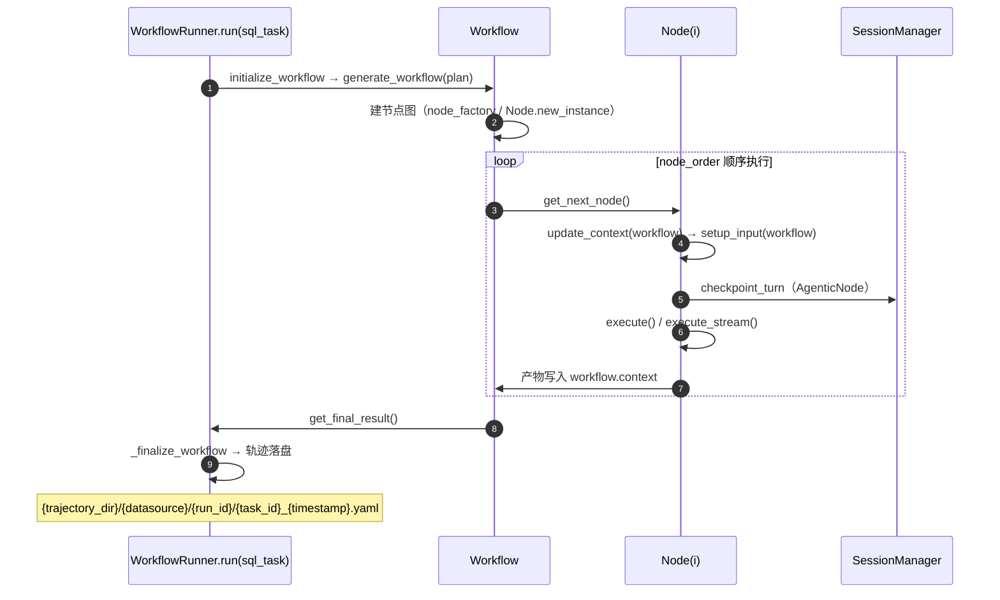

# Datus 智能数据代理（Data Agent）详细设计

> **文档编号**：DRD-04
> **版本**：0.1（草稿）
> **状态**：评审中
> **适用产品**：Datus（智能数据代理 / Data Agent，开源数据工程 Agent）
> **编写基准**：以仓库真实实现为准（类名、方法签名、字段、表结构、错误码均核对源码，注明 `文件:行号`）
> **依赖文档**：DRD-01（需求规格说明书）、DRD-02（架构设计）、DRD-03（技术方案）
> **目标**：接口与数据结构具体到可直接编码/可直接验证的程度

---

## 1. 总体说明与模块划分

详细设计覆盖 9 个核心模块，模块划分与 DRD-02 §3.2 一致：

| 模块 | 真实位置 | 本文 § |
|---|---|---|
| Agent 核心（Runner / Session / Tool） | `datus/agent/`、`datus/models/session_manager.py`、`datus/tools/` | §2 |
| 语义层（Metric / Dimension / Semantic Model） | `datus/storage/{metric,semantic_model,reference_sql}/` | §3 |
| SQL 引擎（生成 / 校验 / 执行） | `datus/prompts/`、`datus/validation/`、`datus/tools/` | §4 |
| 向量存储与检索 | `datus/storage/`（kb_retrieval / vector / fts） | §5 |
| 数据源适配器 | `datus/tools/db_tools/` + `datus_db_core` | §6 |
| 调度器 | `datus/agent/node/scheduler_agentic_node.py` | §7 |
| TUI / CLI | `datus/cli/` | §8 |
| FastAPI 路由与 MCP Server | `datus/api/`、`datus/mcp_server.py` | §9 |
| 可观测性中间件 | `datus/observability/` | §10 |

**通用约定**（全文遵循）：

- 输入/输出模型：Pydantic，`BaseInput` 默认 `extra="forbid"`（`datus/schemas/base.py`）——防拼写错误字段静默通过。
- 节点产物：`BaseResult` 必填 `success: bool`，可选 `error/action_history/execution_stats`。
- 异常：一律 `DatusException(ErrorCode.XXX, ...)`（错误码见 §11），禁止裸抛业务异常。
- 日志：`from datus.utils.loggings import get_logger; logger = get_logger(__name__)`，禁止 `print()`。

---

## 2. Agent 核心详细设计（Runner / Session / Tool）

### 2.1 职责

| 组件 | 职责 |
|---|---|
| Workflow / WorkflowRunner | 工作流定义、DAG 执行、节点间数据传递、轨迹落盘 |
| Node / AgenticNode | 节点契约；AgenticNode 增加多轮会话、工具调用、流式交互 |
| SessionManager | 会话持久化（每个会话一个 SQLite 文件）、回合级事务、压缩/回退/分支 |
| ToolRegistry + tools/ | 工具注册单一事实源、权限挂钩、代理 |

### 2.2 类 / 接口

#### Workflow（`datus/agent/workflow.py:19`）

```python
class Workflow:
    name: str
    task: SqlTask
    workflow_config: dict
    metadata: dict
    nodes: dict[str, Node]          # node_id → Node
    node_order: list[str]
    current_node_index: int
    status: str                     # pending|running|completed|failed|paused
    reflection_round: int
    context: Context                # 节点间共享上下文（§2.3）
    llms: dict
    tools: dict                     # db_function_tools

    def get_next_node(self) -> Node: ...
    def advance_to_next_node(self) -> Node: ...
    def get_last_sqlcontext(self) -> SQLContext:  # 无上下文抛 ErrorCode.NODE_NO_SQL_CONTEXT
    def get_final_result(self) -> BaseResult: ...
    def save(self) / load(self): ...              # YAML 序列化
```

#### Node 基类（`datus/agent/node/node.py`）

```python
class Node:
    def __init__(self, node_id, description, node_type, input_data=BaseInput,
                 agent_config=None, tools=None): ...
    # 属性: id / description / type / input / status("pending|running|completed|failed")
    #       / result / dependencies / metadata / model / tools

    # —— 子类必须实现的三段式 ——
    def update_context(self, workflow: Workflow) -> Dict: ...   # 从工作流读产物 → 更新自身上下文
    def setup_input(self, workflow: Workflow) -> Dict: ...      # 构造类型化输入
    def execute(self) -> BaseResult: ...                        # 同步执行，写 self.result
    async def execute_stream(self, action_history_manager=None) -> AsyncGenerator[ActionHistory, None]: ...
        # 不需流式时: yield（一次）后 return

    # —— 生命周期（基类实现）——
    def run(self) / async run_async() / run_stream(): ...
        # _initialize()（按 nodes 配置经 LLMBaseModel.create_model 建模型）
        # → start() → execute → complete(result) | fail(error)

    @classmethod
    def new_instance(cls, node_id, description, node_type, input_data, agent_config,
                     tools, node_name, is_subagent, session_id): ...
        # 按 NodeType 字符串分派到具体类（node.py:82-257，20+ 类型）
    def to_dict(self) / from_dict(...): ...
        # 按类型还原 Input/Result Pydantic（node.py:496-599）
```

#### AgenticNode（`datus/agent/node/agentic_node.py:66`）

```python
class AgenticNode(Node):
    # 额外构造参数: mcp_servers / scope / is_subagent / session_id
    session_id: str                  # 不可变，构造时生成或恢复
    _session: AdvancedSQLiteSession  # OpenAI Agents SDK 会话
    actions: list[ActionHistory]     # 流式交互动作序列
    DEFAULT_SUBAGENTS = "explore"
    DEFAULT_SKILLS: list
    REQUIRED_SKILLS: list
```

**Node vs AgenticNode**：Node 是纯工作流节点（无会话、无工具循环）；AgenticNode 是带多轮会话/工具调度/流式的 Agent 化节点——两类共用同一 `execute/execute_stream` 生命周期。

#### SessionManager（`datus/models/session_manager.py:68`）

```python
class SessionManager:
    # 封装 SDK AdvancedSQLiteSession；按 {session_dir}/{scope}/ 组织
    # session_id 正则 ^[A-Za-z0-9_.-]+$（:120）

    def get_session(self, session_id) / create_session(...) / clear_session(...): ...
    # 回合级事务（派发模型回合前调用）
    def checkpoint_turn(self, session_id) -> ...:   # 记录 SQLite 边界（:189）
    def rollback_turn(self, session_id, checkpoint) -> ...:  # 原子删除该回合写入（:233）
    def save_system_prompt_snapshot(...) / load(...) / delete(...): ...   # 系统提示词快照（:313）
    def delete_session(...) / copy_session(...) / rewind_session(...): ... # 分支会话（:373/:415/:526）
    def list_sessions(...) / session_exists(...) / get_session_info(...): ...
    def get_detailed_usage(...) / upsert_running_turn_usage(...): ...     # token 用量（:951/:1054）
    def get_session_messages(...) / close_all_sessions(...): ...          #（:1312/:1726）
```

**设计说明**：`rollback_turn` 修正了 SDK `pop_item` 只删 `agent_messages` 的问题——额外删除 message_structure 元数据与 usage 行，保证"回退后用量统计不残留"。这是会话一致性设计的关键细节。

#### ToolRegistry（`datus/tools/registry/tool_registry.py:21`）

```python
class ToolRegistry:
    # tool_name → category 映射；AgenticNode 层共享给 PermissionHooks 与 proxy_tool
    def register_tools(self, category, tools): ...
    def get(self, name) / __contains__ / items / to_dict: ...
```

### 2.3 核心流程



**节点间传递的数据结构**：

- `Context`（`schemas/node_models.py:523`）：`sql_contexts: List[SQLContext]`、`table_schemas`、`table_values`、`metrics`、`doc_search_keywords`、`document_result`、`parallel_results`、`last_selected_result`、`selection_metadata`。
- `SQLContext`（`:462`）：`sql_query / explanation / sql_return / sql_error / row_count / reflection_strategy / reflection_explanation`。
- `SqlTask`（`:27`）：`id, datasource, database_type, task, catalog_name, database_name, schema_name, output_dir, external_knowledge, tables, schema_linking_type, current_date, date_ranges, subject_path`。

### 2.4 异常处理

| 场景 | 异常 | 行为 |
|---|---|---|
| 工作流无 SQL 上下文时取最后 SQL | `NODE_NO_SQL_CONTEXT`（200002） | 终止并提示 |
| 节点执行失败 | `NODE_EXECUTION_FAILED`（200001） | 节点状态置 failed，`fail(error)` 记录 |
| 会话 ID 非法 | `COMMON_VALIDATION_FAILED` | 拒绝创建会话 |

---

## 3. 语义层详细设计（Metric / Dimension / Semantic Model）

### 3.1 职责

语义资产三类存储：`metric/`（指标）、`semantic_model/`（语义模型要素，含维度）、`reference_sql/`（参考 SQL）；均建在 LanceDB 上，向量 + FTS 双索引。

### 3.2 数据模型（LanceDB 表）

#### MetricStorage（`storage/metric/store.py:117`，表名 `metrics`）

| 字段 | 类型 | 说明 |
|---|---|---|
| `id` | string | 主键，如 `"metric:dau"` |
| `semantic_model_name` | string | 所属语义模型 |
| `description` | string | **向量源** |
| `vector` | list[float32, dim] | 向量列 |
| `metric_type` | string | simple / derived / ratio / cumulative |
| `measure_expr` / `base_measures` | string / list | 度量表达式与依赖 |
| `dimensions` / `entities` | list | 维度 / 实体 |
| `catalog / database / schema_name` | string | 物理定位 |
| `sql` / `yaml_path` | string | 生成 SQL / 源文件路径 |
| `uid` / `updated_at` | string | 归属与时间 |

FTS 索引：`name`（boost 3.0）+ `description`。

#### SemanticModelStorage（`storage/semantic_model/store.py:76`，表名 `semantic_model`）

| 字段 | 说明 |
|---|---|
| `id` | 主键，如 `"table:orders"` |
| `kind` | table / column / entity |
| `name` / `fq_name` / `semantic_model_name` | 命名层级 |
| `catalog / database / schema / table_name` | 物理定位 |
| `description` | **向量源** |
| `is_dimension / is_measure / is_entity_key / is_deprecated` | bool 要素标记 |
| `expr` / `column_type` / `agg` / `create_metric` | 度量/维度定义 |
| `agg_time_dimension` / `is_partition` / `time_granularity` | 时间要素 |
| `entity` / `yaml_path` / `updated_at` | 实体与溯源 |

#### ReferenceSqlStorage（`storage/reference_sql/store.py:22`，表名 `reference_sql`）

字段：`id, sql, comment, summary, search_text`（**向量源**）、`filepath, tags, vector`。FTS boost：`name`(3.0) / `summary`(2.0) / `search_text`(2.0) / `tags`(1.5) / `sql`。

**设计说明**：语义模型的"维度/度量"被拍平为 `kind=column` 的要素行（`is_dimension/is_measure` 标记），检索时按要素组装；`search_text` 作为混合检索向量源，把注释、摘要、SQL 全文都纳入语义空间。

### 3.3 核心流程

指标问答主路径（DRD-03 §3.2）：`search_metrics`（向量 + FTS 命中候选指标）→ `date_parser` 解析时间 → 语义适配器生成 DSL/SQL → 执行。检索时按 `rag_scope/scoped_filter` 限定领域与项目（FR-040/041）。

### 3.4 异常处理

| 场景 | 异常 |
|---|---|
| 语义适配器未配置 | `SEMANTIC_ADAPTER_NOT_FOUND`（600001） |
| 适配器执行失败 | `SEMANTIC_ADAPTER_ERROR`（600002） |
| 适配器配置错误 | `SEMANTIC_CONFIG_ERROR`（600003） |
| 同步/引导失败 | `SEMANTIC_SYNC_FAILED`（600004）/ `SEMANTIC_BOOTSTRAP_FAILED`（600005） |

---

## 4. SQL 引擎详细设计（生成 / 校验 / 执行）

### 4.1 生成

**接口**（`datus/prompts/gen_sql.py`）：`get_sql_prompt(schema, detail, metrics, task, ...) -> [system, user]`

- 上下文截断硬上限：schema 4000 / data details 2000 / context 8000 / 单值 500 / 文本标记 16（DRD-03 §3.3.1）。
- 模板版本经 `prompt_version` 参数切换（`gen_sql_system_1.1/1.2.j2`、`gen_sql_user_1.0.j2`，中英双语目录 `prompt_templates(_zh)/`）。
- 能力章节按 `available_tool_names` 动态开关（Jinja2 ``）。

**修复**（`fix_sql.py`）：`fix_sql_prompt(sql_task, sql_context, docs, schemas)` 渲染 `fix_sql_system` + user 消息。

**反思**（`datus/agent/evaluate.py` / `reflect.py`）：

```python
# evaluate.py:16 — LLM 打分
classification = model.generate_with_json_output(evaluation_prompt)["classification"]
# 校验合法策略值，否则 "UNKNOWN"（:52-55）
if classification not in STRATEGY_LIST: classification = "UNKNOWN"

# reflect.py:46 — 工作流级编排
update_context_from_node(...) → workflow.get_next_node() → setup_node_input(...)
```

### 4.2 校验

| 层 | 实现 | 说明 |
|---|---|---|
| 语法/方言 | `datus/utils/sql_utils.py`（`parse_dialect` :40、`parse_sql_statement_kind` :765） | SQLGlot 解析 + 首关键字分类 |
| 规则集 | `datus/validation/builtin_checks.py` + 校验 Skill（`sql-modeling-preflight` 等） | 可插拔校验规则 |
| 行数守卫 | `datus/tools/sql_guard.py`（`estimate_rows_from_explain` :110，`MAX_ESTIMATED_ROWS=50_000_000`） | EXPLAIN 估算，解析失败 fail-open |
| 策略扩展 | `datus/tools/sql_policy.py`（`SqlPolicyEnforcer.enforce_read(sql, *, datasource, dialect, principal)`） | `agent.sql_policy.provider` 动态加载 |

### 4.3 执行

**工具接口**（`datus/tools/func_tool/database.py:1428`）：

```python
@mcp_tool()
def execute_sql(self, sql: str, datasource: Optional[str] = "",
                database: Optional[str] = "",
                min_rows: Optional[int] = None, max_rows: Optional[int] = None,
                ) -> FuncToolResult:
    """Execute a single SQL statement against the current database connection.
    ...（Google 风格 docstring：概述 + 分类说明 + CAUTION + Args + Returns）"""
```

**统一返回** `FuncToolResult`（`func_tool/base.py:123`）：`success: int`（1/0）、`error: Optional[str]`、`result: Optional[Any]`。

**权限求值**（`datus/tools/permission/permission_manager.py`）：

```python
def check_permission(self, tool_name, params, node_id=None, ...) -> PermissionDecision:
    # 默认值起算 → 全局规则 → 节点覆盖规则，顺序求值、最后匹配生效（:207-219）
    # 同特异性 DENY 优先；_rule_matches 用 fnmatch glob（* / db_tools / execute_*）
def filter_available_tools(self, tool_names) -> list:  # DENY 工具从 system prompt 隐藏（:273）
def request_user_confirmation(self, ...) / approve_for_session(self, ...): ...  # HITL / 会话放行（:337/:375）
def switch_profile(self, profile): ...                # normal|auto|dangerous（:507）
```

拦截点：`permission_hooks.py` `PermissionHooks.on_tool_start`（:341）→ `_handle_sql_permission`（:778，按 read/write/destructive/unknown 门控）→ `_request_sql_confirmation`（:990）。

### 4.4 异常处理

| 场景 | 异常（节选） |
|---|---|
| 模型请求失败 | `MODEL_REQUEST_FAILED`（300001） |
| 模型响应非法 | `MODEL_INVALID_RESPONSE`（300002） |
| 模型超时 | `MODEL_TIMEOUT`（300003） |
| 模型未配置 | `MODEL_NOT_CONFIGURED`（300025） |
| 数据库执行失败 | `DB_EXECUTION_FAILED`（500005~500008 细分） |
| 表不存在 | `DB_TABLE_NOT_FOUND`（500010） |

---

## 5. 向量存储与检索详细设计

### 5.1 职责

LanceDB 向量 + Tantivy 全文双索引，按领域分表，检索融合排序后注入生成上下文。

### 5.2 类 / 接口

| 类 | 位置 | 职责 |
|---|---|---|
| `LanceVectorTable/Database/Backend` | `storage/vector/lance_backend.py` | LanceDB 封装；embedding 经 `@register("fastembed")`/`@register("openai")` 注册 |
| `FastEmbedEmbeddings` | `storage/fastembed_embeddings.py:22` | 本地嵌入（默认 all-MiniLM-L6-v2，batch 256，进程级缓存 :112，本地优先检查 :154） |
| `PlainLanceStore` | `storage/kb_retrieval/store.py:128` | 直接封装表：`search_fts`（:317）/`create_indices`（:230） |
| `MetadataFtsRAG` | 同文件 :432 | 高层检索：`search_table`（:596）、`search_similar`（:632，schema 行 + 采样值行）、`search_tables`（:713）、`refresh_tables`（:836） |
| `BackendHolder` | `storage/backend_holder.py` | 全局单例；`init_backends`（:35）、懒初始化（:77/:97），默认 sqlite+lance，项目作物理隔离路径组件 |
| `get_storage` | `storage/registry.py:93` | (factory, embedding_model, project, datasource_id) LRU 缓存（maxsize 256） |

### 5.3 检索流程

`search(query_type="hybrid")` → `_search_hybrid`（`base.py:610`）调 `table.search_hybrid`（:621）→ 异常按 `allow_hybrid_fallback` 降级纯向量（:633）→ 分数排序（`SCORE_FIELDS = ["_score","_relevance_score","_distance"]`）→ 领域过滤（`rag_scope`/`scoped_filter`）→ 注入上下文。

### 5.4 表结构通用约定

LanceDB 通用列（`storage/subject_tree/store.py:666`）：`name: string, subject_id: int64, created_at: string`；公共基类约定 `vector_source_name`、`vector_column_name="vector"`（`list(float32, dim_size)`）。

### 5.5 异常处理

| 场景 | 异常 |
|---|---|
| 存储操作失败 | `STORAGE_FAILED`（410000） |
| 连接失败 | `STORAGE_CONNECTION_FAILED`（410001） |
| 表操作失败 | `STORAGE_TABLE_OPERATION_FAILED`（410002） |
| 检索失败 | `STORAGE_SEARCH_FAILED`（410004） |
| 条目不存在 | `STORAGE_ENTRY_NOT_FOUND`（410006） |

---

## 6. 数据源适配器详细设计

### 6.1 类 / 接口

| 类 | 位置 | 职责 |
|---|---|---|
| `DBManager` | `db_tools/db_manager.py:193` | `get_conn(datasource, database)`（:199）、`first_conn`（:224）、`get_db_uris`（:242）、懒建连（:277/:293） |
| `db_manager_instance` | 同文件 :437 | 模块级单例；`set_db_manager_factory`（:418）测试替换点 |
| `ConnectorRegistry` | `datus_db_core` 外部包（`db_tools/__init__.py:5` 再导出） | 适配器注册与分派；内置 sqlite/duckdb（:22），插件 `discover_adapters`（:61） |
| 方言工具 | `utils/sql_utils.py` | `parse_dialect`（:40）、`parse_metadata_from_ddl`（:53）、`extract_table_names`（:131，IGNORE/RAISE 两档） |

### 6.2 连接生命周期

配置（YAML/`${ENV}`）→ 首次访问懒建连 → 按 datasource+database 缓存 → 元数据注册进 schema_metadata → 查询经 SQL 安全链执行。连接失败不影响其他数据源（FR-030 异常）。

### 6.3 异常处理

| 场景 | 异常（节选） |
|---|---|
| 数据库连接失败 | `DB_CONNECTION_FAILED`（500001~500004 细分） |
| 事务失败 | `DB_TRANSACTION_FAILED`（500009） |
| 约束违反 | `DB_CONSTRAINT_VIOLATION`（500011） |
| 数据源未配置 | `COMMON_VALIDATION_FAILED` + 可用列表提示（`database.py:388-392` 真实示例） |

---

## 7. 调度器详细设计

### 7.1 类 / 接口

```python
class SchedulerAgenticNode(DeliverableAgenticNode):       # node/scheduler_agentic_node.py:27
    def setup_tools(self): ...                            # :80
        # _setup_domain_tools（:92，仅在配置了 scheduler 服务时实例化 SchedulerTools）
        # + _setup_filesystem_tools（写 jobs/<name>.sql）
        # + 可选 _setup_ask_user_tool

class SchedulerTools(BaseTool):                           # tools/func_tool/scheduler_tools.py:24
    def available_tools(self) -> list[FunctionTool]: ...  # :846，12 个工具
        # submit_sql_job / submit_sparksql_job / trigger_scheduler_job / pause_job
        # resume_job / delete_job / update_job / get_scheduler_job
        # list_scheduler_jobs / list_scheduler_connections / list_job_runs / get_run_log
        # 可用 conn_ids 动态追加进 submit/update 的 tool.description（:856-866）
```

### 7.2 流程

自然语言调度需求 → LLM 解析 cron + 作业定义 → filesystem 工具写 `jobs/<name>.sql` → `submit_sql_job` 经 `datus-scheduler-airflow` 提交 Airflow → 返回 job_id；监控经 `list_job_runs`/`get_run_log`。选择顺序：显式 → 项目钉选（`./.datus/config.yml` 的 `scheduler:`）→ 全局 default → 单实例捷径（DRD-01 FR-051）。

### 7.3 异常处理

未配置调度器时工具不注册（用户不可见）；连接失败返回明确错误；`dag_discovery_timeout` 默认 60s 控制发现超时。

---

## 8. TUI / CLI 详细设计

### 8.1 样式体系（`datus/cli/cli_styles.py`）

集中常量：`TABLE_HEADER_STYLE="green"`（:50）、`TABLE_BORDER_STYLE="blue"`（:51）、`CODE_THEME="monokai"`（:54）、`SQL_TAG_COLORS`（:68）、`AUTOCOMPLETE_TOKEN_COLORS`（:84）、`STATUS_BAR_STYLE`（:177）、`SUB_AGENT_WIZARD_STYLE`（:283）。统一输出：`print_error/print_success/print_warning/print_info/print_status`（:308-345）、`render_tui_title_bar`（:349）。

**规范约束**（CLAUDE.md）：颜色不加 `bold`（bold 仅标题/提示标签）；`✓`/`✗` Unicode 符号；表格 `header_style=TABLE_HEADER_STYLE`，优先 `build_row_table()`（`_render_utils.py`）；`Syntax()` 一律 `CODE_THEME="monokai"`。

### 8.2 全屏组件约定（`datus/cli/model_app.py`）

`ModelApp`（:143）prompt_toolkit 表单应用：`_Tab/_View` 枚举（:102/:111）、`ModelSelection` 结果模型（:121）、`run()`（:237）构建 KeyBindings 后 `Application.run()`；`build_embedded_panel`（:273）返回 EmbeddedWizard 可嵌入主 TUI。约定：`tui_app.suspend_input()` 包裹全屏运行、不嵌套 `asyncio.run`、`DynamicContainer + Condition` 守卫、退出经 `app.exit(result=Selection(...))`。

### 8.3 命令注册（`datus/cli/slash_registry.py`）

命令注册表为单一事实源（比文档多出 `/plugins`、`/bootstrap`、`/save`、`/services`）；三大魔法命令 `/`（聊天）、`@`（上下文注入）、`!`（工具执行）；分组见 DRD-01 FR-061。

---

## 9. FastAPI 路由与 MCP Server 详细设计

### 9.1 API 请求 / 响应模型

#### 统一响应（`api/models/base_models.py:10`）

```python
class Result(BaseModel, Generic[T]):
    success: bool
    data: Optional[T]
    errorCode: Optional[str]
    errorMessage: Optional[str]
```

#### Chat 流式请求（`api/models/cli_models.py:281` `StreamChatInput(ChatInput)`）

| 字段（基类 `ChatInput` :115 节选） | 说明 |
|---|---|
| `message` | 必填，用户消息 |
| `session_id` | 续接会话 |
| `model` | `provider/model_id` 格式覆盖 |
| `plan_mode` / `max_turns`（默认 30） | 计划模式 / 轮次上限 |
| `datasource` / `catalog` / `database` / `db_schema` | 数据定位 |
| `table_paths` / `metric_paths` / `sql_paths` / `knowledge_paths` | `@` 引用路径 |
| `stream_response` | 是否流式 |
| `subagent_id` / `prompt_version` / `prompt_language`（默认 en） / `language` | Subagent 与提示词控制 |
| `source_session_id` / `permission_mode` | 分支来源 / 权限模式 |

#### SSE 事件（`cli_models.py:610`）

```json
{"id": 1, "event": "message", "data": {"type": "createMessage", "message": {...}}, "timestamp": "..."}
```

- `event` 取值（实际发出）：`session`、`message`、`usage`、`ping`、`end`、`error`（文档声明集合含 start/thinking/action/response 等，以代码为准）。
- `data.type`：`createMessage / appendMessage / updateMessage`（`SSEDataType`）。
- `end` 事件含 token 汇总：`input/output/total/cached_tokens、duration、requests`。
- 线路格式（`chat_routes.py:154`）：`id: {event.id}\nevent: {event.event}\ndata: {event.data.model_dump_json()}`。

#### 用户头校验（`api/auth/no_auth_provider.py:41-56`）

`X-Datus-User-Id`（常量 `HEADER_USER_ID`，`api/constants.py:8`）可选；不匹配 `USER_ID_PATTERN`（字母/数字/下划线/连字符）抛 `COMMON_VALIDATION_FAILED`。`deps.py:51` 认证后 `AppContext` 缓存到 `request.state.app_context`，按 project 缓存 DatusService。

### 9.2 主要路由一览

| 类别 | 端点 | 文档 |
|---|---|---|
| Chat | `/api/v1/chat/stream`（SSE）、`resume`、`stop`、`insert`、`sessions`、`history`、`user_interaction`、`tool_result`、`feedback` | DRD-01 §5.2 |
| KB | `/api/v1/kb/bootstrap`（SSE）、`bootstrap-docs` | 同上 |
| MCP | `/api/v1/mcp/servers`（CRUD）、`connectivity`、`tools`、`call`、`filters` | 同上 |
| SQL | `/api/v1/sql/execute`、`stop_execute` | 同上 |
| 配置 | `/api/v1/config/agent`、`config/datasources(+test)`、`config/models(+test)` | 同上 |

### 9.3 MCP Server 注册机制（`datus/mcp_server.py` + `utils/mcp_decorators.py`）

```python
# 类级注册（database.py:75-79）：availability_property 控制可用性
@mcp_tool_class(name="db_tool", availability_property="has_db_tools")
class DBFuncTool:
    permission_category: str = "db_tools"   # 权限归属（database.py:91）
    @classmethod
    def create_dynamic(cls, ...) / create_static(cls, ...): ...  # 两种工厂模式

# 方法级注册（database.py:992）：availability_check 按属性判断
@mcp_tool(availability_check="has_schema")
def search_table(self, ...) -> FuncToolResult: ...

# 模块导入即注册（mcp_server.py:112-119 触发 _GLOBAL_TOOL_REGISTRY）
# DatusMCPServer._register_tools（:421）按 has_db_tools 等可用性注册
```

- 动态模式（`register_dynamic_tools` :200+）：`inspect.signature` 去 self 生成 schema，运行时从 context 取实例——同一 server 服务多数据源；静态模式（`create_static_tool_wrapper` :170）固定实例。
- `ToolContextManager` 按 `datasource:subagent` 键缓存 `ToolContext`（LRU 64），按 `services.datasources`/`agentic_nodes` 配置键校验可用性。

### 9.4 异常处理

工具层统一 `FuncToolResult(success=0, error=...)`；API 层统一 `Result(success=False, errorCode=..., errorMessage=...)`；无 token 认证场景非法用户头 → `COMMON_VALIDATION_FAILED`。

---

## 10. 可观测性中间件详细设计

### 10.1 类 / 接口（`datus/observability/`）

```python
class ObservabilityManager:                      # manager.py:35，单例 get_observability_manager()
    def span(self, name, attributes, run_id=None): ...   # 上下文管理器（:94）
    def trace_baggage(self, name, attributes): ...        # 上下文管理器（:148）
    def record_event(self, ...): ...                      #（:165）
    def redact(self, ...): ...                            #（:88，走 privacy.redact_value）
    def content_enabled(self, field_name) -> bool: ...    # capture.* 开关（:81）
    def flush(self) / shutdown(self): ...                 #（:172/:179）

# 原生 Agent 循环追踪（native_agents.py）
def trace_native_agent_stream(...): ...        # 装饰器（:31），显式 span 生命周期 + GeneratorExit 关闭路径
def start_native_generation_span(...): ...     #（:130）
def start_native_tool_span(...): ...           # function_span + mcp tool_call_id（:147）
def finish_native_span(...): ...               #（:158）

# 脱敏（privacy.py）
def redact_value(value) -> Any: ...            # 递归脱敏（:15）
    # Mapping 键名命中敏感字段 → "[REDACTED]"（_is_sensitive_field :45，
    #   camelCase→snake_case 归一、多段字段序列匹配）
    # 字符串按 config.patterns 正则替换（:36）；RedactConfig.enabled 总开关
```

### 10.2 配置模型（`observability/config.py`，挂 `AgentConfig.observability`，agent_config.py:798）

```python
ObservabilityConfig(
    enabled=False, capture_content=True,
    capture=CaptureConfig(prompts, responses, reasoning, tool_args, tool_results, sql, artifacts),
    adapters=[ObservabilityAdapterConfig(type="langfuse", enabled, endpoint, protocol, headers, timeout, features)],
    redact=RedactConfig(...),
)
```

> 注意：`observability/capture` 配置节未出现在 `conf/agent.yml.example`，但代码中存在完整配置模型——实际使用以代码为准（启用需 `tracing.enabled: true`，仅设 API key 不开启）。

### 10.3 埋点流程

工作流/基准/KB 引导/Agent 会话四个 span 覆盖点（DRD-01 FR-090）→ `manager.span` 上下文管理器包裹 → 脱敏 → 适配器导出（langfuse 默认，多后端并存）。SDK 自动 span 经 `openai_agents.py` OpenInference 并入；自定义循环经 `native_agents.py` 手动管理（async generator 关闭路径专门处理）。

---

## 11. 错误码与异常体系

### 11.1 ErrorCode 枚举（`datus/utils/exceptions.py`）

每个成员 = `(code字符串, 描述模板)`；`DatusException(code, message=None, message_args=None)`——消息优先级：显式 `message` > `message_args` 格式化 `code.desc`（KeyError 降级）> 直接 `desc`；`str(ex)` = `f"error_code={code.code}, error_message={final_message}"`。

| 类别 | 编号范围 | 代表成员 |
|---|---|---|
| COMMON 通用 | 100000–100011 | UNKNOWN(100000)、FIELD_INVALID(100001)、FIELD_REQUIRED(100003)、UNSUPPORTED(100004)、ENV(100005)、CONFIG_ERROR(100006)、MISSING_DEPENDENCY(100007)、VALIDATION_FAILED(100008)、JSON_PARSE_ERROR(100009)、TEMPLATE_NOT_FOUND(100010)、FILE_NOT_FOUND(100011) |
| NODE 节点 | 200001–200002 | NODE_EXECUTION_FAILED、NODE_NO_SQL_CONTEXT |
| MODEL 模型/LLM | 300001–300025 | REQUEST_FAILED、INVALID_RESPONSE、TIMEOUT；300011–300024 对齐 Anthropic/OpenAI 状态码（401/403/404/413/429/500/529…）；300025 NOT_CONFIGURED；300030–300033 OAuth；300034–300036 Claude 订阅 |
| TOOL 工具 | 400001–400003 | EXECUTION_FAILED、INVALID_INPUT、BASH_SANDBOX_UNAVAILABLE |
| VALIDATION | 400010–400030 | BLOCKING_FAILURE(400010)、OUTPUT_MALFORMED(400011)、RUNNER_ERROR(400012)、SKILL_FRONTMATTER_INVALID(400020)、PLUGIN_STORE_ERROR(400030) |
| STORAGE 向量库 | 410000–410007 | FAILED、CONNECTION_FAILED、TABLE_OPERATION_FAILED、SEARCH_FAILED、ENTRY_NOT_FOUND 等 |
| DB 数据库 | 500000–500011 | FAILED、连接类(500001–4)、执行类(500005–8)、TRANSACTION_FAILED(500009)、TABLE_NOT_FOUND(500010)、CONSTRAINT_VIOLATION(500011) |
| SEMANTIC 语义 | 600001–600005 | ADAPTER_NOT_FOUND、ADAPTER_ERROR、CONFIG_ERROR、SYNC_FAILED、BOOTSTRAP_FAILED |

### 11.2 全局异常处理

`setup_exception_handler(console_logger=None, prefix_wrap_func=None)`（exceptions.py:221）安装 `sys.excepthook`；SystemExit/KeyboardInterrupt/GeneratorExit 放行（不吞用户中断）。

### 11.3 真实使用示例

```python
# tools/func_tool/database.py:388-392
raise DatusException(
    ErrorCode.COMMON_VALIDATION_FAILED,
    message=f"Datasource '{ds}' is not configured. Available datasources: {', '.join(self._datasources)}.",
) from e
```

---

## 12. 配置项设计（agent.yml 结构）

来源：`conf/agent.yml.example`（560 行）。顶层仅 `agent:` 一节：

| 配置节 | 关键字段 | 说明 |
|---|---|---|
| `agent.home` / `project_name` | 路径；`^[a-zA-Z0-9_-]+$` ≤200 | 全局与项目标识 |
| `agent.providers.<name>` | `api_key: ${ENV}`、`auth_type: subscription|oauth` | Provider 级凭据 |
| `agent.models.<name>` | `type/base_url/api_key/model` | 自定义/自托管模型 |
| `agent.target` | provider/model | legacy 激活选择（新路径：`./.datus/config.yml` 的 `target`） |
| `agent.permissions` | `profile: normal|auto|dangerous`、`rules`（tool+pattern+permission）、`bash_commands`、`sql_statements`（read/write/destructive/unknown） | 权限档与规则（§4.3） |
| `agent.bash` | `enabled`、`sandbox.{enabled, mode, allow_read, allow_write, deny_network}` | Bash 沙箱 |
| `agent.filesystem` | `strict/allow_read/allow_write` | 文件系统边界 |
| `agent.nodes.<type>` | `matching_rate/prompt_version/max_table_schemas_length/max_context_length/max_turns/workspace_root/check_result` | 节点级调参 |
| `agent.export.max_lines` | int | 导出行数上限 |
| `agent.benchmark.<name>` | `question_file/question_id_key/db_key/gold_sql_path/gold_result_path` 等 | 基准数据集定义 |
| `agent.services.datasources.<name>` | `type`（snowflake/sqlite/duckdb/starrocks…）+ 连接参数（`${ENV}`） | 数据源 |
| `agent.services.semantic_layer.<adapter>` | 可 `default: true` | 语义适配器（MetricFlow/OSI/Dosi） |
| `agent.services.bi_platforms.<name>` | `type/api_base_url/username/password/extra` | BI 平台 |
| `agent.services.schedulers.<name>` | `type/api_base_url/dags_folder/dag_discovery_timeout/connections` | 调度器 |
| `agent.storage` | `rdb.type: sqlite`、`vector.type: lance`、`embedding_device_type: cpu`；`database/document/metric/semantic_model/reference_sql` 各节 `{registry_name, model_name, dim_size, batch_size}` | 存储与嵌入（默认 all-MiniLM-L6-v2/384） |
| `agent.workflow.plan` | 各 plan 节点序列（支持 `parallel:`、subworkflow `steps`+`config`） | 工作流定义 |
| `agent.reflection_nodes.<name>` | 节点序列 | 反思工作流 |
| `agent.agentic_nodes.<subagent>` | `model/system_prompt/tools（"db_tools.*, context_search_tools.*"）/max_turns/skills` | Subagent 定义（§13） |
| `agent.document.<platform>` | `type: github|website|local`、`source`、`chunk_size/include_patterns/exclude_patterns/github_token/paths/max_depth/tavily_api_key` | 平台文档导入 |
| `agent.skills.directories` | 路径列表 | 技能目录 |

---

## 13. 数据字典补充：Subagent 定义

自定义 Subagent（`docs/subagent/customized_subagent.md`，配置于 `agent.agentic_nodes.<name>`）：

| 字段 | 说明 |
|---|---|
| `system_prompt` | subagent 名 + 配置键，对应模板 `{agent_name}_system_{prompt_version}.j2` |
| `node_class` | 节点类（向导支持 gen_sql/gen_report；explore/gen_table/gen_skill/gen_dashboard/scheduler 需手写 yml） |
| `prompt_version` / `prompt_language` | 提示词版本与语言 |
| `agent_description` | 对外描述 |
| `tools` | 逗号分隔的类别/方法模式（`db_tools`、`semantic_tools.*`、`context_search_tools.list_subject_tree`） |
| `mcp` | 外部 MCP server 或 `server.tool` 列表 |
| `rules` | 字符串列表，追加进 system prompt |
| `scoped_context.{datasource, tables, metrics, sqls}` | 领域上下文限定 |

内置 Subagent 集合：`datus/utils/constants.py` `SYS_SUB_AGENTS`；`BUILTIN_SUBAGENTS = SYS_SUB_AGENTS - HIDDEN_SYS_SUB_AGENTS`（`api/constants.py:17`）。节点创建：`node_factory.create_interactive_node(subagent_name, agent_config, ...)`（node_factory.py:19）分派到节点类；`create_node_input` 由 `_build_typed_node_input` 构造类型化输入并经 `apply_at_context` 统一挂 `@` 上下文。

---

## 14. 环境变量清单

| 变量 | 用途 |
|---|---|
| `OPENAI_API_KEY` / `DEEPSEEK_API_KEY` / `ANTHROPIC_API_KEY` / `KIMI_API_KEY` / `DASHSCOPE_API_KEY` / `GEMINI_API_KEY` / `MINIMAX_API_KEY` / `GLM_API_KEY` / `OPENROUTER_API_KEY` | Provider 凭据（`conf/providers.yml` 的 `api_key_env`） |
| `SNOWFLAKE_ACCOUNT/USER/PASSWORD/PRIVATE_KEY_FILE/PRIVATE_KEY_FILE_PWD/ROLE` | Snowflake |
| `STARROCKS_HOST/PORT/USER/PASSWORD/DATABASE` | StarRocks |
| `AIRFLOW_USERNAME/AIRFLOW_PASSWORD` | Airflow |
| `TAVILY_API_KEY` / `GITHUB_TOKEN` | 文档导入 |
| `SSL_VERIFY` / `SSL_CERT_FILE` | TLS（优先级：agent.yml `ssl_verify` > 变量） |
| `DATUS_HOME` / `DATUS_BIN_DIR` / `DATUS_VERSION` / `DATUS_FORCE` / `DATUS_NO_MODIFY_PATH` | 安装/运行时路径 |
| `DATUS_AUTH_PATH` / `CLAUDE_CODE_OAUTH_TOKEN` | 认证存储 |

---

*（本文档所有类名、方法签名、字段、表结构、错误码均核对源码并注明 `文件:行号`；未验证内容一律不写入。与官方文档冲突处以代码为准。）*
